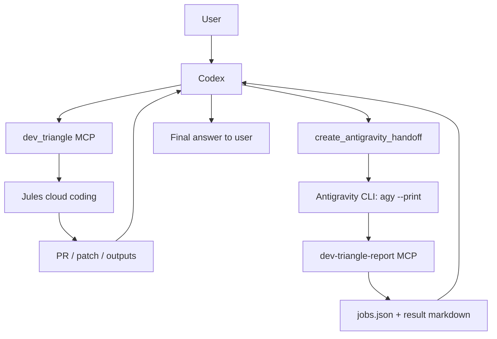

# Dev Triangle MCP

Dev Triangle MCP is a local workflow control plane for using Codex, Jules, and Antigravity together without mixing up their jobs.

Plainly:

- Codex is the commander: reads the project, decides the route, reviews results.
- Jules is the cloud coding worker: useful for larger or repetitive code changes.
- Antigravity is the local validation agent: useful for local files, tests, Docker, IDE context, and environment checks.
- Dev Triangle MCP is the ledger and handoff layer between them.

## Local Install

Default local layout:

```text
Tool root:  %USERPROFILE%\DevTools\dev-triangle-mcp
State root: %USERPROFILE%\.dev-triangle
```

Install or refresh local config:

```powershell
.\scripts\install-local.ps1
```

Run diagnostics:

```powershell
.\scripts\doctor.ps1
```

Run smoke tests:

```powershell
.\scripts\smoke.ps1
```

Run a real user-flow demo:

```powershell
.\scripts\demo-user-flow.ps1
```

## How To Use On A New Project

In Codex, ask:

```text
Use Dev Triangle MCP for this project:
C:\path\to\my-project

Goal:
fix the bug / add smoke tests / review the PR / validate the local environment
```

Codex then chooses the route:

```text
Small change
  -> Codex edits and verifies directly

Large or repetitive coding work
  -> dev_triangle MCP
  -> Jules
  -> PR / patch / outputs
  -> Codex review and local verification

Local validation
  -> dev_triangle MCP
  -> create Antigravity handoff
  -> agy --print
  -> dev-triangle-report MCP
  -> Codex reads the result
```

## Flow



## MCP Surfaces

Codex sees the full server:

```text
dev_triangle -> server.py
```

Antigravity sees only the report server:

```text
dev-triangle-report -> antigravity_report_server.py
```

That split is intentional. Antigravity should not see the full Jules/control-plane toolset. It only needs to submit the final local result back to Codex.

## State

Runtime state is stored outside the source tree:

```text
%USERPROFILE%\.dev-triangle
```

Important folders:

```text
jobs.json
antigravity-handoffs
antigravity-results
patches
optimization
```

## Secrets

Jules requires:

```powershell
$env:JULES_API_KEY = "your key"
```

Do not write this key into:

- Git
- README files
- MCP config files
- jobs.json
- handoff/result markdown

The local installer intentionally does not store the Jules key.

## Antigravity

The stable unattended path is:

```text
%LOCALAPPDATA%\agy\bin\agy.exe
```

The main server calls:

```powershell
agy --model "Gemini 3.5 Flash (Medium)" --print --print-timeout 30m --dangerously-skip-permissions "handoff prompt..."
```

The older `antigravity-ide.cmd chat` route can open the UI, but it is not the stable unattended completion path on this machine.

## Tools

Main MCP tools include:

- Jules: `jules_list_sources`, `jules_create_session`, `jules_get_session`, `jules_list_activities`, `jules_send_message`, `jules_approve_plan`, `jules_get_outputs`, `jules_save_latest_patch`
- Antigravity: `create_antigravity_handoff`, `antigravity_detect_cli`, `run_antigravity_handoff`, `antigravity_get_result`, `submit_antigravity_result`
- Ledger and diagnostics: `mcp_health_check`, `job_list`, `job_get`, `job_update`

Report MCP tools include:

- `dev_triangle_report_health`
- `complete_dev_triangle_handoff`

## Safety Rules

- Codex stays the orchestrator.
- Jules is used only when cloud coding work is worth it.
- Antigravity receives a narrow handoff and reports back through one small MCP server.
- The MCP server does not expose a generic shell executor.
- Local state is separated from source code.
- Secrets stay in environment variables or a proper secret store.
