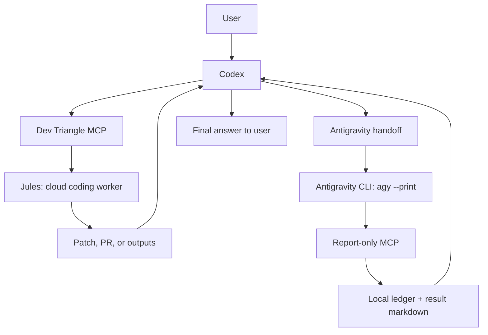

# Dev Triangle MCP

Dev Triangle MCP is a local MCP workflow control plane for people who want
Codex, Jules, and Antigravity to work together without losing track of who is
doing what.

In plain English:

- **Codex** is the orchestrator. It talks to the user, decides the route, checks
  the work, and gives the final answer.
- **Jules** is the cloud coding worker. It is useful for larger code changes,
  repetitive edits, dependency upgrades, test expansion, and PR-oriented work.
- **Antigravity** is the local verifier. It is useful for local files, local
  commands, Docker, IDE context, and machine-specific validation.
- **Dev Triangle MCP** is the handoff desk, job ledger, and result mailbox that
  lets those agents form a closed loop.

The goal is simple: make multi-agent development feel like one coordinated
workflow instead of three disconnected chats.

## Status

Current stable profile:

```text
Codex -> Dev Triangle MCP -> Jules -> Antigravity
```

What is stable today:

- Codex can connect to the full `dev_triangle` MCP server.
- Jules can be used through MCP when `JULES_API_KEY` is present.
- Antigravity can be launched through the unattended `agy --print` route.
- Antigravity receives a narrow task handoff and reports back through a tiny
  report-only MCP server.
- The local ledger records jobs, handoffs, statuses, result paths, and notes.
- CI validates the MCP protocol on Windows and Ubuntu without needing real
  Jules or Antigravity credentials.

What is intentionally not claimed:

- This is not a generic remote shell server.
- This does not give every worker every tool.
- This does not store Jules secrets for you.
- The older Antigravity IDE chat launch path can open a UI, but the stable
  unattended path is `agy --print`.
- CI uses deterministic fake worker paths. Real local Antigravity validation is
  covered by `scripts/demo-user-flow.ps1` on a machine with `agy` installed.

## Why This Exists

When one AI agent does everything, context gets expensive and messy. When many
AI agents work separately, the user becomes the project manager and has to copy
tasks, paste results, remember statuses, and check whether a worker actually
finished.

Dev Triangle MCP gives the workflow a shared shape:



The important idea is the **closed loop**:

1. Codex creates a task or handoff through MCP.
2. The worker does the job.
3. The worker writes a result through a controlled return channel.
4. Codex reads the result from the ledger.
5. Codex decides whether the work is accepted, needs another pass, or should be
   escalated to the user.

## Mental Model

Think of the system as a small development team:

| Role | Default tool | Job | Should see full MCP server? |
| --- | --- | --- | --- |
| Orchestrator | Codex | Understand the user request, route work, review results, answer the user | Yes |
| Cloud coding worker | Jules | Do larger or repetitive coding work in the cloud | No |
| Local verifier | Antigravity | Run local checks, inspect local state, validate environment-specific behavior | No |
| Reporter | `dev-triangle-report` MCP | Let workers submit final results | No, it is already narrow |

The split matters. If every worker can call every tool, the workflow can loop in
confusing ways. Dev Triangle MCP keeps the full control plane with the
orchestrator and gives workers only the reporting surface they need.

## Install

Clone the repo:

```powershell
git clone https://github.com/SpadesZ/dev-triangle-mcp.git
cd dev-triangle-mcp
```

Install or refresh local MCP config:

```powershell
.\scripts\install-local.ps1
```

Run diagnostics:

```powershell
.\scripts\doctor.ps1
```

Run deterministic smoke tests:

```powershell
.\scripts\smoke.ps1
```

Run a real user-flow demo on a machine with Antigravity `agy` installed:

```powershell
.\scripts\demo-user-flow.ps1
```

Default local layout:

```text
Tool root:  %USERPROFILE%\DevTools\dev-triangle-mcp
State root: %USERPROFILE%\.dev-triangle
```

The source tree is safe to publish. Runtime state lives outside the source tree
or in ignored folders.

## Secrets

Jules requires an API key:

```powershell
$env:JULES_API_KEY = "your key"
```

Do not commit this key. Do not paste it into README files, MCP config files,
handoff markdown, result markdown, or `jobs.json`.

The installer intentionally does not write `JULES_API_KEY` anywhere. It only
allows Codex to inherit the environment variable when you provide it.

## First Real Use

In Codex, point the orchestrator at your project and ask it to use the workflow:

```text
Use Dev Triangle MCP for this project:
C:\path\to\my-project

Goal:
add smoke tests for the login flow, run local validation, and tell me whether
the result is ready to merge.
```

Codex should then choose a route:

```text
Small local edit
  -> Codex edits and verifies directly

Large or repetitive code task
  -> Codex -> Dev Triangle MCP -> Jules
  -> Jules creates patch, PR, or outputs
  -> Codex reviews and verifies locally

Local validation task
  -> Codex -> Dev Triangle MCP -> Antigravity handoff
  -> agy --print runs the handoff
  -> dev-triangle-report MCP stores the result
  -> Codex reads the result and reports back
```

## When To Use Each Route

Use **Codex directly** when:

- The change is small.
- The code path is clear.
- Local tests can be run quickly.
- You need tight interactive reasoning.

Use **Jules** when:

- The task touches many files.
- The task is repetitive.
- The task can be expressed as a clear coding assignment.
- A patch or PR is the desired output.
- Cloud execution saves local context and user time.

Use **Antigravity** when:

- The task depends on local files or machine state.
- You need to run local commands, Docker, or environment checks.
- You want a second local agent to verify the result.
- The final output should be a structured report back to Codex.

Use **Jules plus Antigravity** when:

- Jules does the broad code work.
- Codex reviews the patch or PR.
- Antigravity runs local verification.
- Codex gives the final decision.

## MCP Surfaces

Codex gets the full server:

```text
dev_triangle -> server.py
```

Antigravity gets only the report server:

```text
dev-triangle-report -> antigravity_report_server.py
```

This is intentional. Antigravity should not receive the full Jules and ledger
control plane. It only needs to submit a completed handoff result.

## Runtime State

State is stored in:

```text
%USERPROFILE%\.dev-triangle
```

Important paths:

```text
jobs.json
antigravity-handoffs/
antigravity-results/
patches/
optimization/
```

The most important file is `jobs.json`. It is the local ledger that lets Codex
find past jobs, handoffs, result files, and statuses.

## Tool Groups

Main MCP server tools:

- Jules tools: create sessions, list sessions, approve plans, send feedback,
  read outputs, save patches.
- Antigravity tools: create handoffs, detect CLI, run handoffs, wait for
  results, submit results.
- Ledger tools: health check, list jobs, get jobs, update statuses and notes.

Report-only MCP server tools:

- `dev_triangle_report_health`
- `complete_dev_triangle_handoff`

For the full list, see [Tool Reference](docs/TOOL_REFERENCE.md).

## Documentation Map

Start here:

- [User Guide](docs/USER_GUIDE.md) - the long plain-language explanation.
- [New Project Workflow](docs/NEW_PROJECT_WORKFLOW.md) - how to use this on a
  fresh project.
- [Architecture](docs/ARCHITECTURE.md) - how the pieces connect.
- [Tool Reference](docs/TOOL_REFERENCE.md) - what each MCP tool does.
- [Troubleshooting](docs/TROUBLESHOOTING.md) - common failures and fixes.
- [Glossary](docs/GLOSSARY.md) - short definitions of repeated terms.
- [Provider Model](docs/PROVIDERS.md) - how future Claude/Gemini-style profiles
  could fit.
- [Config Examples](config/README.md) - copyable config examples.
- [Security](SECURITY.md) - secrets and local execution boundaries.
- [Roadmap](ROADMAP.md) - planned provider work.
- [Contributing](CONTRIBUTING.md) - how to develop and test changes.

## Safety Rules

- Keep Codex as the orchestrator unless you intentionally configure another
  orchestrator.
- Give the full `dev_triangle` MCP server only to the orchestrator.
- Give worker agents the report-only MCP server.
- Do not expose a generic shell executor over MCP.
- Keep runtime state out of Git.
- Keep secrets in environment variables or a proper secret manager.
- Treat mock/fake workers as tests only, not final proof of a real worker run.

## Development

Compile:

```powershell
python -m py_compile server.py antigravity_report_server.py
```

Run protocol smoke tests:

```powershell
python tests\protocol_smoke.py
python tests\report_server_smoke.py
```

Run the local smoke wrapper:

```powershell
.\scripts\smoke.ps1
```

Run the real local demo:

```powershell
.\scripts\demo-user-flow.ps1
```

CI runs the deterministic smoke tests on Windows and Ubuntu.

## What Good Looks Like

A healthy setup usually has this shape:

```text
doctor.ps1
  -> Codex config contains dev_triangle
  -> Antigravity/Gemini config contains dev-triangle-report only
  -> Python is available
  -> agy is available if you want real Antigravity runs

smoke.ps1
  -> main MCP protocol smoke passes
  -> report MCP protocol smoke passes
  -> Antigravity CLI detection returns a real status

demo-user-flow.ps1
  -> creates a tiny demo project
  -> creates an Antigravity handoff
  -> runs agy --print
  -> receives a result through the report-only MCP
  -> writes a JSON demo report
```

If the workflow reaches `COMPLETED` and the result contains
`DEV_TRIANGLE_RESULT_READY`, the closed-loop return path worked.
