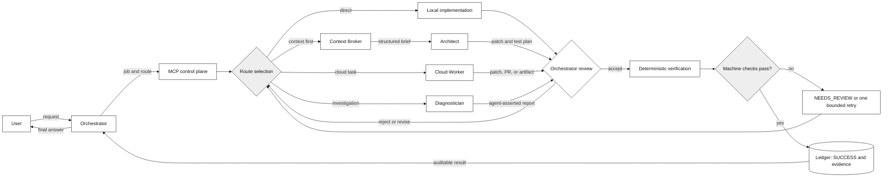
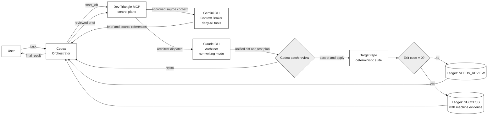

# Dev Triangle MCP

Dev Triangle MCP is a local, role-based MCP control plane for coordinating AI
agents through explicit handoffs, review gates, deterministic verification, and
a persistent job ledger.

[](https://github.com/SpadesZ/dev-triangle-mcp/actions/workflows/ci.yml)

In plain English:

- The **orchestrator** talks to the user, decides the route, checks the work,
  and gives the final answer.
- A **context broker** reads approved source material and returns a compact brief.
- An **architect** produces a patch and test plan without editing the target repo.
- A **cloud code worker** can handle larger PR-oriented or repetitive work.
- The **deterministic verifier** runs only the target repo's declared commands
  and records exit codes as machine evidence.
- A **diagnostician** may investigate local state, but its report is advice, not
  proof that tests passed.
- A **report-only channel** lets workers submit final results without receiving
  the full control plane.
- **Dev Triangle MCP** is the handoff desk, job ledger, and result mailbox that
  lets those roles form a closed loop.

The goal is simple: make several AI subscriptions work as one auditable system
without hard-coding a vendor into a role.

The currently validated three-account deployment is:

```text
Orchestrator             = Codex
Context Broker           = Gemini CLI with deny-all tool policy
Architect                = Claude CLI in non-writing mode
Final evidence source    = target repo deterministic verification suite
Control plane and ledger = Dev Triangle MCP
```

This is a validated binding, not a permanent vendor assignment. Any role can use
an API or CLI binding when its profile satisfies the same contract. The repo has
no implicit provider profile; an unselected or incomplete profile fails visibly.

## Status

Validated real closed loop, completed on 2026-08-20:

```text
Codex -> Gemini Context Broker -> Claude Architect -> Codex review/apply
      -> deterministic verification -> SUCCESS or NEEDS_REVIEW
```

What is stable today:

- Seven fixed role slots with user-selected display names and providers.
- `kind: "api"` and `kind: "cli"` routing by binding, not vendor name.
- Whole-profile activation with persistent selection and one-step undo.
- Real Gemini Broker -> Claude Architect dispatch with Codex review gates.
- Reviewed patch application with a clean-tree guard and rollback evidence.
- `SUCCESS` requires machine evidence and exit code 0.
- CLI usage reports calls separately and states when tokens are unavailable.
- Legacy `jules_*` cloud-worker and `antigravity_*` diagnostician routes remain
  available as compatibility paths.
- The main server exposes 30 tools; the report-only server exposes 2 tools.
- The accepted revision passed 162 unit tests, protocol smoke, report smoke,
  `scripts/smoke.ps1`, and all 11 `scripts/doctor.ps1` checks.

What is intentionally not claimed:

- This is not a generic remote shell server.
- This does not give every worker every tool.
- This does not store provider secrets for you.
- This does not choose a fallback model or silently change providers when a
  quota is exhausted.
- CLI token totals are not measurable unless the CLI reports them.
- An agent's statement that tests passed is not machine evidence.
- The local `three-account` profile contains machine-specific executable paths,
  so it is intentionally ignored by Git; the reusable template and Broker
  deny-all policy are committed.

## Why This Exists

When one AI agent does everything, context gets expensive and messy. When many
AI agents work separately, the user becomes the project manager and has to copy
tasks, paste results, remember statuses, and check whether a worker actually
finished.

Dev Triangle MCP gives the workflow a shared shape. Figure 1 shows the abstract
roles. Rectangles are processes, diamonds are decision gates, and the cylinder
is persistent evidence. Provider names are deliberately absent.


```mermaid
flowchart LR
  U["User"] -->|request| O["Orchestrator"]
  O -->|job and route| M["MCP control plane"]
  M --> R{"Route selection"}
  R -->|direct| L["Local implementation"]
  R -->|context first| B["Context Broker"]
  B -->|structured brief| A["Architect"]
  R -->|cloud task| W["Cloud Worker"]
  R -->|investigation| D["Diagnostician"]
  L --> G{"Orchestrator review"}
  A -->|patch and test plan| G
  W -->|patch, PR, or artifact| G
  D -->|agent-asserted report| G
  G -->|reject or revise| R
  G -->|accept| V["Deterministic verification"]
  V --> Q{"Machine checks pass?"}
  Q -->|no| N["NEEDS_REVIEW or one bounded retry"]
  N --> R
  Q -->|yes| S[("Ledger: SUCCESS and evidence")]
  S -->|auditable result| O
  O -->|final answer| U

  classDef process fill:#ffffff,stroke:#111111,color:#111111,stroke-width:1px;
  classDef decision fill:#eeeeee,stroke:#111111,color:#111111,stroke-width:1px;
  classDef store fill:#ffffff,stroke:#111111,color:#111111,stroke-width:1px;
  class U,O,M,L,B,A,W,D,G,V,N process;
  class R,Q decision;
  class S store;
  linkStyle default stroke:#111111,stroke-width:1px;
```

**Figure 1. Role-agnostic control, work, review, and evidence flow.**

Figure 2 maps the accepted local three-account profile to those roles. The two
diamonds are human/orchestrator and machine gates; neither external model can
write `SUCCESS` by itself.


```mermaid
flowchart LR
  U["User"] -->|task| C["Codex<br/>Orchestrator"]
  C -->|start_job| M["Dev Triangle MCP<br/>control plane"]
  M -->|approved source context| G["Gemini CLI<br/>Context Broker<br/>deny-all tools"]
  G -->|brief and source references| C
  C -->|reviewed brief| M
  M -->|architect dispatch| A["Claude CLI<br/>Architect<br/>non-writing mode"]
  A -->|unified diff and test plan| P{"Codex patch review"}
  P -->|reject| C
  P -->|accept and apply| V["Target repo<br/>deterministic suite"]
  V --> E{"Exit code = 0?"}
  E -->|no| N[("Ledger: NEEDS_REVIEW")]
  E -->|yes| S[("Ledger: SUCCESS<br/>with machine evidence")]
  N --> C
  S --> C
  C -->|final result| U

  classDef process fill:#ffffff,stroke:#111111,color:#111111,stroke-width:1px;
  classDef decision fill:#eeeeee,stroke:#111111,color:#111111,stroke-width:1px;
  classDef store fill:#ffffff,stroke:#111111,color:#111111,stroke-width:1px;
  class U,C,M,G,A,V process;
  class P,E decision;
  class N,S store;
  linkStyle default stroke:#111111,stroke-width:1px;
```

**Figure 2. Validated three-account binding and deterministic acceptance gates.**

The important idea is the **closed loop**:

1. The orchestrator selects an explicit route and creates a ledger entry.
2. Each external role receives only the context needed for its bounded task.
3. The orchestrator reviews the brief and patch before any local write.
4. The target repo's declared commands produce machine evidence.
5. The ledger records `SUCCESS` only when the evidence gate passes.

## Mental Model

Think of the system as a small development team. The role contract is stable;
the provider binding is selected by the user.

| Role | Validated local binding | Job | Full MCP server? |
| --- | --- | --- | --- |
| Orchestrator | Codex | Understand the user request, route work, review results, answer the user | Yes |
| Context Broker | Gemini CLI | Produce a compact brief and source references; no tools | No |
| Architect | Claude CLI | Produce a patch and test plan; no direct target writes | No |
| Verifier | Built-in suite runner | Run repo-declared commands and capture exit codes | No agent controls it |
| Cloud Worker | Optional; Jules compatibility route available | Produce a patch, PR, or artifact | No |
| Diagnostician | Optional; Antigravity compatibility route available | Investigate and return agent-asserted findings | No |
| Reporter | `dev-triangle-report` MCP | Let workers submit final results | No, it is already narrow |

The split matters. If every worker can call every tool, the workflow can loop in
confusing ways. Dev Triangle MCP keeps the full control plane with the
orchestrator and gives workers only the reporting surface they need.

## Install

Clone the repo:

```powershell
git clone https://github.com/SpadesZ/dev-triangle-mcp.git
cd dev-triangle-mcp
```

Install or refresh local MCP config:

```powershell
.\scripts\install-local.ps1
```

Run diagnostics:

```powershell
.\scripts\doctor.ps1
```

Run deterministic smoke tests:

```powershell
.\scripts\smoke.ps1
```

Run a real user-flow demo on a machine with Antigravity `agy` installed:

```powershell
.\scripts\demo-user-flow.ps1
```

Default local layout:

```text
Tool root:  %USERPROFILE%\DevTools\dev-triangle-mcp
State root: %USERPROFILE%\.dev-triangle
```

The source tree is safe to publish. Runtime state lives outside the source tree
or in ignored folders.

## Secrets

Jules requires an API key:

```powershell
$env:JULES_API_KEY = "your key"
```

Do not commit this key. Do not paste it into README files, MCP config files,
handoff markdown, result markdown, or `jobs.json`.

The installer intentionally does not write `JULES_API_KEY` anywhere. It only
allows Codex to inherit the environment variable when you provide it.

## First Real Use

First select a configured profile with `profile_activate`. The repository does
not choose a provider for you. Then ask the orchestrator to use the workflow:

```text
Use Dev Triangle MCP for this project:
C:\path\to\my-project

Goal:
add smoke tests for the login flow, run local validation, and tell me whether
the result is ready to merge.
```

The orchestrator should then choose a route and record it in the job:

```text
Small local edit
  -> Orchestrator edits -> deterministic verification

Large repo, patch output
  -> Context Broker -> Orchestrator review -> Architect
  -> Orchestrator patch review/apply -> deterministic verification

Architect only
  -> Architect -> Orchestrator patch review/apply
  -> deterministic verification

PR-oriented cloud task
  -> Optional cloud worker -> Orchestrator review

Local diagnosis
  -> Optional diagnostician -> report-only MCP -> Orchestrator
```

## When To Use Each Route

Use the **orchestrator directly** when:

- The change is small.
- The code path is clear.
- Local tests can be run quickly.
- You need tight interactive reasoning.

Use a **cloud worker** such as the Jules compatibility route when:

- The task touches many files.
- The task is repetitive.
- The task can be expressed as a clear coding assignment.
- A patch or PR is the desired output.
- Cloud execution saves local context and user time.

If the local project is not on GitHub yet, use `prepare_jules_repo` first. It
can inspect the folder, add safe `.gitignore` defaults, create a private GitHub
repo, push the project, and return the Jules source string.

Use **Broker → Architect** (`dispatch_context_brief` then `dispatch_architect`)
when:

- The repo is large enough that reading all of it with an expensive model is
  wasteful, but you still want the expensive model writing the code.
- You want the change delivered as a patch you can inspect and roll back rather
  than as commits already made.
- You have configured the `contextBroker` and `architect` roles, and the repo is
  listed in `config/outbound-repos.json`.

This route sends repository contents to an external API. It refuses for any repo
not on that allowlist, and there is no default entry.

Use a **diagnostician** such as the Antigravity compatibility route when:

- The task depends on local files or machine state.
- You need to run local commands, Docker, or environment checks.
- You want a second opinion on *why* something is failing.
- The final output should be a structured report back to the orchestrator.

Note that Antigravity now reports as a diagnostician, not a verifier. Its
findings are recorded as `agent_asserted` and cannot by themselves make a job
`SUCCESS`. For that you need `run_verification_suite`, which runs the commands
your repo declares in its own `.dev-triangle/verify.json` and records the real
exit code.

Use a **cloud worker plus diagnostician** when:

- Jules does the broad code work.
- The orchestrator reviews the patch or PR.
- Antigravity investigates local failures when needed.
- The deterministic suite supplies evidence and the orchestrator gives the final decision.

## MCP Surfaces

Only the orchestrator gets the full server:

```text
dev_triangle -> server.py
```

External workers or diagnosticians get only the report server when they need to
submit a result:

```text
dev-triangle-report -> antigravity_report_server.py
```

This is intentional. A worker should not receive provider-configuration, dispatch,
patch-application, verification, and ledger controls. It only needs the bounded
task and a narrow result path.

## Runtime State

State is stored in:

```text
%USERPROFILE%\.dev-triangle
```

Important paths:

```text
jobs.json
antigravity-handoffs/
antigravity-results/
patches/
optimization/
```

The most important file is `jobs.json`. It is the local ledger that lets Codex
find past jobs, handoffs, result files, and statuses.

## Tool Groups

Main MCP server tools:

- Closed-loop tools: start jobs, dispatch context briefs, dispatch architects,
  apply reviewed patches, run deterministic verification, and perform one
  bounded self-heal attempt.
- Profile tools: describe, activate, change, and revert role bindings.
- Jules repo preparation: inspect or publish a local project as a private
  GitHub repo for Jules.
- Jules tools: create sessions, list sessions, approve plans, send feedback,
  read outputs, save patches.
- Antigravity tools: create handoffs, detect CLI, run handoffs, wait for
  results, submit results.
- Ledger tools: health check, list jobs, get jobs, update statuses and notes.

Report-only MCP server tools:

- `dev_triangle_report_health`
- `complete_dev_triangle_handoff`

For the full list, see [Tool Reference](docs/TOOL_REFERENCE.md).

## Documentation Map

Start here:

- [User Guide](docs/USER_GUIDE.md) - the long plain-language explanation.
- [Role Model](docs/ROLE_MODEL.md) - the tool-agnostic contract behind the
  workflow.
- [New Project Workflow](docs/NEW_PROJECT_WORKFLOW.md) - how to use this on a
  fresh project.
- [Architecture](docs/ARCHITECTURE.md) - how the pieces connect.
- [Tool Reference](docs/TOOL_REFERENCE.md) - what each MCP tool does.
- [Troubleshooting](docs/TROUBLESHOOTING.md) - common failures and fixes.
- [Glossary](docs/GLOSSARY.md) - short definitions of repeated terms.
- [Provider Model](docs/PROVIDERS.md) - how API and CLI bindings map to roles.
- [Config Examples](config/README.md) - copyable config examples.
- [Security](SECURITY.md) - secrets and local execution boundaries.
- [Roadmap](ROADMAP.md) - planned provider work.
- [Contributing](CONTRIBUTING.md) - how to develop and test changes.

## Safety Rules

- Keep one clear orchestrator. The accepted local profile currently binds Codex,
  but the architecture does not require that vendor.
- Give the full `dev_triangle` MCP server only to the orchestrator.
- Give worker agents the report-only MCP server.
- Do not expose a generic shell executor over MCP.
- The verification suite runner is allowlisted and repo-declared. See docs/SAI.md S7.1.
- Keep runtime state out of Git.
- Keep secrets in environment variables or a proper secret manager.
- Treat mock/fake workers as tests only, not final proof of a real worker run.

## Development

Compile:

```powershell
python -m py_compile server.py antigravity_report_server.py
```

Run protocol smoke tests:

```powershell
python tests\protocol_smoke.py
python tests\report_server_smoke.py
```

Run the local smoke wrapper:

```powershell
.\scripts\smoke.ps1
```

Run the real local demo:

```powershell
.\scripts\demo-user-flow.ps1
```

CI runs the deterministic smoke tests on Windows and Ubuntu.

## What Good Looks Like

A healthy setup usually has this shape:

```text
doctor.ps1
  -> at least one orchestrator config contains dev_triangle
  -> worker/diagnostician configs contain dev-triangle-report only
  -> active profile is explicit and configured roles resolve
  -> Python is available
  -> optional CLIs are available when their bindings are enabled

smoke.ps1
  -> main MCP protocol smoke passes
  -> report MCP protocol smoke passes
  -> provider and compatibility detection returns explicit status

demo-user-flow.ps1
  -> creates a tiny demo project
  -> creates an Antigravity handoff
  -> runs agy --print
  -> receives a result through the report-only MCP
  -> writes a JSON demo report
```

If the workflow reaches `COMPLETED` and the result contains
`DEV_TRIANGLE_RESULT_READY`, the closed-loop return path worked.
