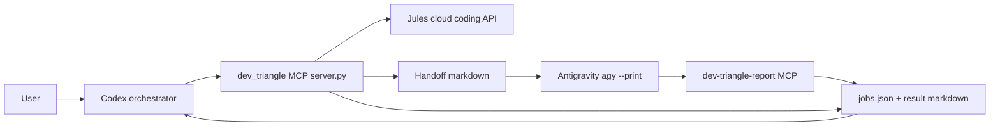
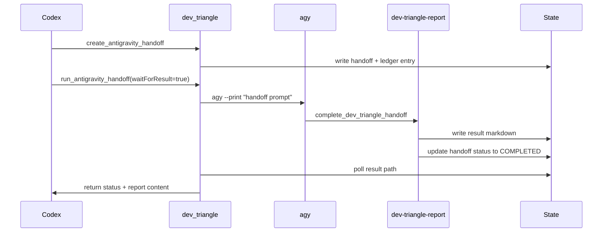
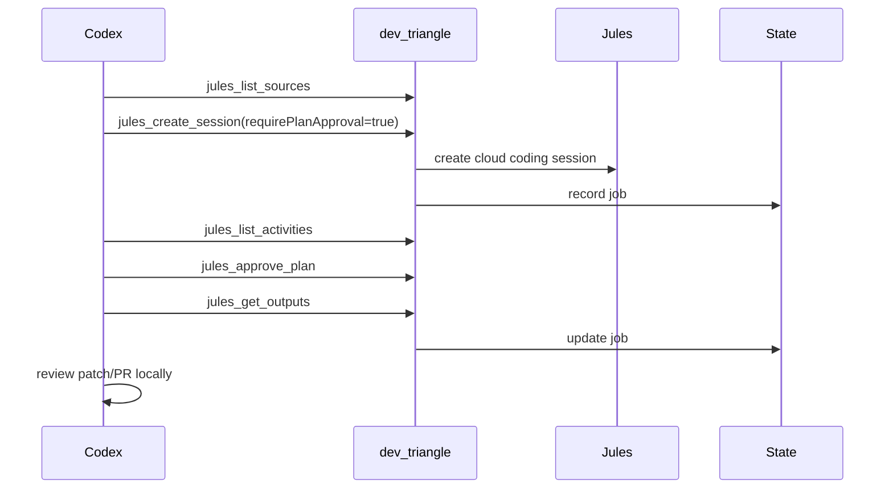

# Architecture

Dev Triangle MCP keeps orchestration, worker execution, and result reporting as
separate responsibilities.

The design is intentionally conservative:

```text
One orchestrator sees the full control plane.
Workers receive narrow tasks.
Workers report back through a narrow result surface.
Runtime state stays outside the source tree.
```

## Components



## Responsibilities

| Component | Responsibility | Should do | Should not do |
| --- | --- | --- | --- |
| Codex | Orchestration | Understand the user, route work, review results | Blindly trust worker output |
| `server.py` | Main MCP control plane | Jules calls, handoffs, ledger, health checks | Expose generic shell execution |
| Jules | Cloud coding | Larger edits, repetitive work, PR/patch output | Receive local secrets |
| Antigravity | Local verification | Local checks, environment validation, report writing | Control the whole workflow |
| `antigravity_report_server.py` | Report-only MCP | Accept final worker reports | Create Jules sessions or launch tools |
| `jobs.json` | Local ledger | Track statuses and result paths | Store secrets |

## Why Two MCP Servers?

The full server and report server have different trust levels.

### Full Server

Name:

```text
dev_triangle
```

File:

```text
server.py
```

This server is for the orchestrator. It can call Jules, create and run
Antigravity handoffs, inspect the ledger, and update jobs.

### Report Server

Name:

```text
dev-triangle-report
```

File:

```text
antigravity_report_server.py
```

This server is for workers. It exposes only:

- `dev_triangle_report_health`
- `complete_dev_triangle_handoff`

This keeps worker agents focused. They can submit a result, but they cannot
start unrelated cloud sessions or mutate the whole workflow.

## Antigravity Closed Loop



The completion marker is:

```text
DEV_TRIANGLE_RESULT_READY
```

If that marker is missing, Codex should not treat the handoff as fully ready.

## Jules Loop



The default plan approval pause is a safety feature. It gives the orchestrator
or user a chance to review the cloud worker plan before code changes proceed.

## State Layout

Runtime state belongs outside Git:

```text
%USERPROFILE%\.dev-triangle
```

Important files and folders:

```text
jobs.json
antigravity-handoffs/
antigravity-results/
patches/
optimization/
```

Repo-local generated folders are ignored:

```text
.dev-triangle-test/
.dev-triangle-report-test/
demo-output/
logs/
```

## Failure Boundaries

Dev Triangle MCP tries to make failures visible instead of mysterious.

Examples:

- If Jules has no key, health checks report key absence.
- If `agy` is missing, CLI detection reports unavailable.
- If Antigravity runs but does not submit a result, the handoff remains
  `AWAITING_RESULT`.
- If a result file lacks `DEV_TRIANGLE_RESULT_READY`, the result is not treated
  as complete.

See [Troubleshooting](TROUBLESHOOTING.md) for practical fixes.

## Provider Direction

The current runtime remains:

```text
Codex -> Jules -> Antigravity
```

Future provider profiles may allow other orchestrators or workers, such as:

```text
Claude -> Gemini CLI -> Antigravity
```

See [Provider Model](PROVIDERS.md) for the planned shape.
