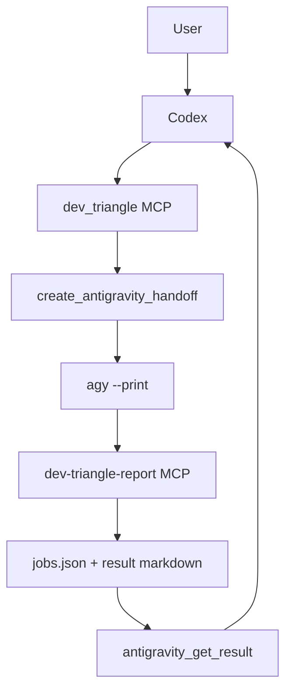

# Architecture

Dev Triangle MCP keeps orchestration and execution responsibilities separate.

## Roles

```text
Codex
  Owns task understanding, routing, review, and final user communication.

dev_triangle MCP
  Owns local job ledger, Jules API calls, Antigravity handoff creation, and result polling.

Jules
  Handles cloud coding work such as larger edits, repetitive test additions, or dependency migrations.

Antigravity
  Handles local validation through agy CLI and reports back through a tiny report-only MCP server.
```

See [PROVIDERS.md](PROVIDERS.md) for planned provider abstraction. The current
runtime still defaults to Codex + Jules + Antigravity.

## Why Two MCP Servers?

Codex gets the full `dev_triangle` server because it is the orchestrator.

Antigravity gets only `dev-triangle-report` because it should not see the full control plane. The report server has only two tools:

- `dev_triangle_report_health`
- `complete_dev_triangle_handoff`

This keeps Antigravity focused on completing a handoff and submitting a result.

## Closed Loop



## State

Runtime state should live outside the source tree:

```text
%USERPROFILE%\.dev-triangle
```

The source tree is safe to publish. Runtime state, handoff history, result logs, and local demos are ignored by Git.
