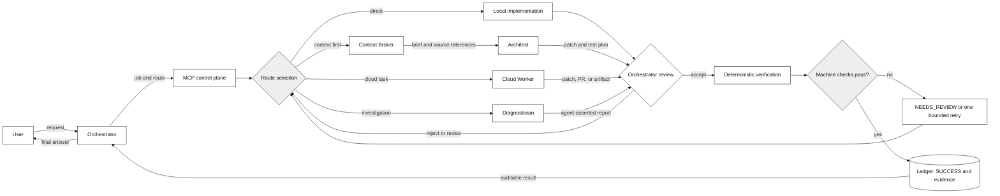
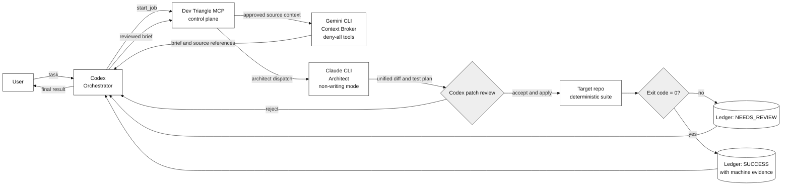
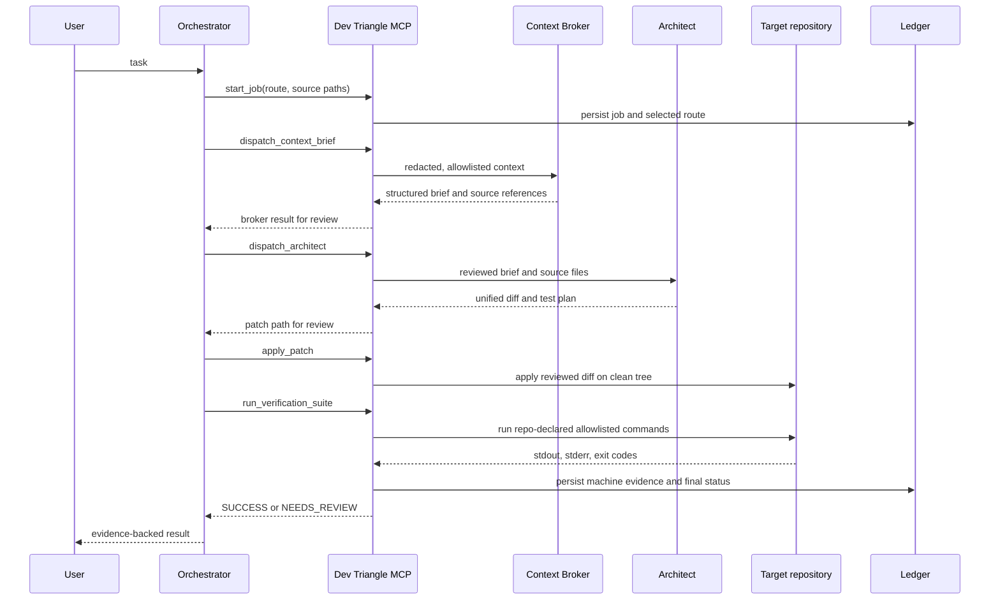

# Architecture

Dev Triangle MCP separates control, bounded agent work, local mutation, and
acceptance evidence. The architecture is role-based first and provider-specific
only at profile binding time.

## Design Invariants

1. One orchestrator owns the full `dev_triangle` control plane.
2. Provider names and model versions are not architecture concepts.
3. External agents receive narrow tasks and cannot set final success.
4. A patch is reviewed before it is applied to the target repository.
5. `SUCCESS` requires machine evidence and exit code 0.
6. Runtime state and machine-local provider paths stay outside published source.
7. Provider failure is visible; there is no automatic model downgrade.

## Figure Convention

The figures use a journal-style monochrome convention:

- Rectangles are actors or processes.
- Diamonds are review or acceptance decisions.
- Cylinders are persistent state or evidence.
- Arrow labels state the transferred artifact or control action.
- Provider-independent and concrete deployment views are separate figures.

## Role-Based Control and Evidence Flow


```mermaid
flowchart LR
  U["User"] -->|request| O["Orchestrator"]
  O -->|job and route| M["MCP control plane"]
  M --> R{"Route selection"}
  R -->|direct| L["Local implementation"]
  R -->|context first| B["Context Broker"]
  B -->|brief and source references| A["Architect"]
  R -->|cloud task| W["Cloud Worker"]
  R -->|investigation| D["Diagnostician"]
  L --> G{"Orchestrator review"}
  A -->|patch and test plan| G
  W -->|patch, PR, or artifact| G
  D -->|agent-asserted report| G
  G -->|reject or revise| R
  G -->|accept| V["Deterministic verification"]
  V --> Q{"Machine checks pass?"}
  Q -->|no| N["NEEDS_REVIEW or one bounded retry"]
  N --> R
  Q -->|yes| S[("Ledger: SUCCESS and evidence")]
  S -->|auditable result| O
  O -->|final answer| U

  classDef process fill:#ffffff,stroke:#111111,color:#111111,stroke-width:1px;
  classDef decision fill:#eeeeee,stroke:#111111,color:#111111,stroke-width:1px;
  classDef store fill:#ffffff,stroke:#111111,color:#111111,stroke-width:1px;
  class U,O,M,L,B,A,W,D,G,V,N process;
  class R,Q decision;
  class S store;
  linkStyle default stroke:#111111,stroke-width:1px;
```

**Figure 1. Provider-independent route, review, and evidence model.** Solid
arrows show control or artifact transfer. A loop is permitted only through an
explicit rejection or one bounded repair attempt.

## Validated Three-Account Deployment

The accepted local profile binds roles as follows. The binding is a deployment
example, not a vendor lock:

| Contract | Current local binding | Boundary |
| --- | --- | --- |
| Orchestrator | Codex | Full MCP control plane and final user response |
| Context Broker | Gemini CLI | Deny-all tool policy; structured brief only |
| Architect | Claude CLI | Patch and test plan; no direct target write |
| Verifier | Built-in suite runner | Repo-declared commands and captured exit codes |
| Ledger | `jobs.json` | Status, artifacts, destinations, and evidence |


```mermaid
flowchart LR
  U["User"] -->|task| C["Codex<br/>Orchestrator"]
  C -->|start_job| M["Dev Triangle MCP<br/>control plane"]
  M -->|approved source context| G["Gemini CLI<br/>Context Broker<br/>deny-all tools"]
  G -->|brief and source references| C
  C -->|reviewed brief| M
  M -->|architect dispatch| A["Claude CLI<br/>Architect<br/>non-writing mode"]
  A -->|unified diff and test plan| P{"Codex patch review"}
  P -->|reject| C
  P -->|accept and apply| V["Target repo<br/>deterministic suite"]
  V --> E{"Exit code = 0?"}
  E -->|no| N[("Ledger: NEEDS_REVIEW")]
  E -->|yes| S[("Ledger: SUCCESS<br/>with machine evidence")]
  N --> C
  S --> C
  C -->|final result| U

  classDef process fill:#ffffff,stroke:#111111,color:#111111,stroke-width:1px;
  classDef decision fill:#eeeeee,stroke:#111111,color:#111111,stroke-width:1px;
  classDef store fill:#ffffff,stroke:#111111,color:#111111,stroke-width:1px;
  class U,C,M,G,A,V process;
  class P,E decision;
  class N,S store;
  linkStyle default stroke:#111111,stroke-width:1px;
```

**Figure 2. Validated three-account binding and deterministic acceptance
gates.** Gemini and Claude produce artifacts. Codex controls review and apply.
The target repository's verification suite controls acceptance evidence.

## Closed-Loop Sequence


```mermaid
sequenceDiagram
  participant U as User
  participant O as Orchestrator
  participant M as Dev Triangle MCP
  participant B as Context Broker
  participant A as Architect
  participant R as Target repository
  participant L as Ledger

  U->>O: task
  O->>M: start_job(route, source paths)
  M->>L: persist job and selected route
  O->>M: dispatch_context_brief
  M->>B: redacted, allowlisted context
  B-->>M: structured brief and source references
  M-->>O: broker result for review
  O->>M: dispatch_architect
  M->>A: reviewed brief and source files
  A-->>M: unified diff and test plan
  M-->>O: patch path for review
  O->>M: apply_patch
  M->>R: apply reviewed diff on clean tree
  O->>M: run_verification_suite
  M->>R: run repo-declared allowlisted commands
  R-->>M: stdout, stderr, exit codes
  M->>L: persist machine evidence and final status
  M-->>O: SUCCESS or NEEDS_REVIEW
  O-->>U: evidence-backed result
```

**Figure 3. Artifact and evidence sequence for the Broker-Architect route.**

## Role Responsibilities

| Role or component | Responsibility | Must not do |
| --- | --- | --- |
| Orchestrator | Understand, route, review, apply, and answer | Blindly trust agent output |
| Context Broker | Produce a compact grounded brief | Edit files or call tools |
| Architect | Produce a patch and test plan | Write directly to the target repo |
| Cloud Worker | Return bounded code work or PR artifacts | Receive unrelated secrets or control tools |
| Diagnostician | Explain local failures and observations | Count as machine verification |
| Deterministic Verifier | Run declared commands and capture evidence | Accept arbitrary caller-supplied shell commands |
| Main MCP | Profiles, dispatch, patch gate, verification, ledger | Expose a generic shell executor |
| Report-only MCP | Accept a narrow final report | Dispatch agents or alter provider settings |
| Ledger | Store state, artifacts, destinations, and evidence | Store credentials |

## MCP Trust Surfaces

### Full control plane

```text
dev_triangle -> server.py
```

Only the orchestrator receives this server. It exposes profile selection,
dispatch, patch application, verification, compatibility adapters, and ledger
operations.

### Report-only surface

```text
dev-triangle-report -> antigravity_report_server.py
```

Workers or diagnosticians may receive this server when they need a return
channel. It exposes only:

- `dev_triangle_report_health`
- `complete_dev_triangle_handoff`

## Provider Profiles

The seven slot keys are fixed because the runtime dispatches by contract:

```text
orchestrator
contextBroker
architect
cloudWorker
verifier
diagnostician
reporter
```

Each slot may be unconfigured or bound to `kind: "api"` or `kind: "cli"` where
supported. Names, models, endpoints, and executable paths belong to the user's
profile. `config/providers.example.json` therefore contains no provider default.

Profile selection order is:

1. `config/active-profile.json`, written by `profile_activate`.
2. `DEV_TRIANGLE_PROFILE`, normally set during installation.
3. No profile. The server reports `ROLE_NOT_CONFIGURED`; it does not guess.

## Compatibility Routes

The following routes remain implemented and useful, but they are not the
architecture's fixed default:

- `jules_*`: cloud sessions, patches, PR outputs, and guarded private publishing.
- `antigravity_*`: local diagnostic handoffs through `agy` and the report-only MCP.

Antigravity output is `agent_asserted`. It can explain a failure, but only
`run_verification_suite` can create the machine evidence required for `SUCCESS`.

## State Layout

Runtime state belongs outside Git:

```text
%USERPROFILE%\.dev-triangle\
  jobs.json
  antigravity-handoffs\
  antigravity-results\
  patches\
  optimization\
```

Machine-local profiles and `config/active-profile.json` are ignored. Reusable
templates, documentation, and safety policy files are committed.

## Failure Semantics

- Missing or incomplete role binding -> `ROLE_NOT_CONFIGURED`.
- Provider timeout or malformed JSON -> explicit dispatch failure; no fallback.
- Dirty target tree -> patch application refusal.
- Agent claim without machine evidence -> cannot reach `SUCCESS`.
- Verification exit code nonzero -> `NEEDS_REVIEW` or one bounded repair attempt.
- Missing report marker -> result remains incomplete or degraded.
- CLI token count unavailable -> `tokensAvailable: false`, never a fabricated 0.

## Acceptance Evidence

The current three-account route was accepted with a real Gemini Broker call, a
real Claude Architect patch, Codex review, patch application, target-repo machine
verification, persisted `SUCCESS`, and a rollback-clean disposable repository.
See [HANDOFF.md](HANDOFF.md) and [PROVIDERS.md](PROVIDERS.md) for the job and test
evidence.
