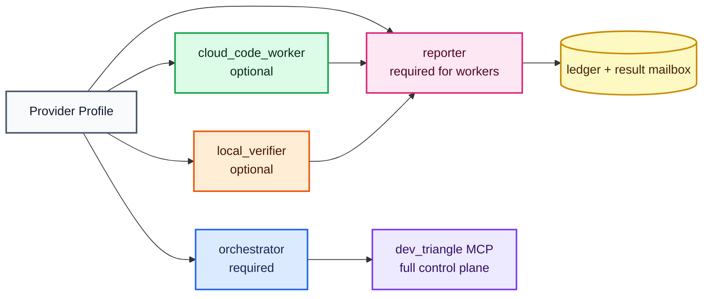

# Provider Model

Dev Triangle MCP is designed around provider roles, but it currently ships with
one stable runtime profile:

```text
Codex -> Dev Triangle MCP -> Jules -> Antigravity
```

This document explains how the same role shape could support other tools later.
It is a design document, not a promise that all profiles are implemented today.

## Provider Slot Diagram



## Current Stable Profile

```text
profile: codex-jules-antigravity

orchestrator: Codex
cloud_code_worker: Jules
local_verifier: Antigravity through agy
reporter: dev-triangle-report MCP
```

This is the profile local productization is built around.

## Implementation Status

| Profile | Status | Notes |
| --- | --- | --- |
| `codex-jules-antigravity` | Implemented and validated | Current default |
| `claude-jules-antigravity` | Design example | Needs orchestrator config docs and validation |
| `codex-gemini-antigravity` | Design example | Needs Gemini worker adapter |
| `claude-gemini-antigravity` | Design example | Needs both orchestrator docs and worker adapter |

The project should not advertise a profile as stable until it has:

- Configuration examples.
- Provider detection.
- Task creation or handoff support.
- Result collection.
- Protocol smoke tests.
- A real local or cloud validation path, not only mocks.

## Why Providers Matter

Users may want to swap role providers:

- Claude as the orchestrator.
- Gemini CLI as the code worker.
- A different local verifier.
- A different report channel.

The workflow should not hard-code one company into every concept. The durable
idea is the role split:

```text
orchestrator -> decides and reviews
worker       -> does bounded work
verifier     -> checks local reality
reporter     -> sends final result back
```

## Role Contracts

### Orchestrator

The orchestrator must be able to:

- Talk to the user.
- Read project context.
- Decide the route.
- Call the full control-plane MCP server.
- Review worker output.
- Produce the final user-facing answer.

Only the orchestrator should see:

```text
dev_triangle -> server.py
```

### Cloud Code Worker

The cloud worker must be able to:

- Receive a bounded coding task.
- Return progress, plan, patch, PR, or artifacts.
- Pause for plan approval when requested.

It should not need:

- Local secrets.
- The full MCP control plane.
- Permission to create more worker tasks.

### Local Verifier

The verifier must be able to:

- Inspect the local repo.
- Run local validation commands.
- Report findings and recommendations.

It should usually receive:

```text
task handoff + dev-triangle-report MCP
```

### Reporter

The reporter must be narrow. It exists so workers can submit results without
getting broad orchestration permissions.

Current reporter:

```text
dev-triangle-report -> antigravity_report_server.py
```

## Example Future Profiles

Claude as the orchestrator:

```text
profile: claude-jules-antigravity

orchestrator: Claude
cloud_code_worker: Jules
local_verifier: Antigravity through agy
reporter: dev-triangle-report MCP
```

Gemini CLI as the code worker:

```text
profile: codex-gemini-antigravity

orchestrator: Codex
cloud_code_worker: Gemini CLI
local_verifier: Antigravity through agy
reporter: dev-triangle-report MCP
```

Claude plus Gemini:

```text
profile: claude-gemini-antigravity

orchestrator: Claude
cloud_code_worker: Gemini CLI
local_verifier: Antigravity through agy
reporter: dev-triangle-report MCP
```

## Design Rule

Only the orchestrator should see the full control-plane MCP server.

Workers should receive narrow task input and a narrow reporting surface. This
prevents worker agents from accidentally calling unrelated tools, creating
circular delegation, or touching secrets they do not need.

```text
orchestrator -> full dev_triangle MCP
worker       -> task prompt + report-only MCP
verifier     -> handoff + report-only MCP
```

## Compatibility Wrappers

The current MCP tools are intentionally concrete:

```text
jules_*
antigravity_*
dev_triangle_report_*
```

They are honest compatibility wrappers for the providers that are actually
implemented today. A future provider registry can add generic internals without
breaking these public names.

## Future Provider Registry

A future implementation could introduce:

```text
providers/
  jules.py
  antigravity.py
  gemini_cli.py
  claude_code.py
```

Each provider should implement a small lifecycle:

```text
detect
create_task
run_or_resume
get_result
submit_result
```

The current public MCP tools should remain stable compatibility wrappers:

```text
jules_*        -> Jules provider adapter
antigravity_*  -> Antigravity provider adapter
job_*          -> shared ledger adapter
```

## What Must Stay Stable

Even if provider profiles are added, these rules should stay stable:

- The default profile remains `codex-jules-antigravity` unless explicitly
  changed.
- Worker agents do not receive the full control plane by default.
- Secrets are not written into repo config.
- Mock providers are tests only.
- Real provider completion must be labeled as real provider completion.
