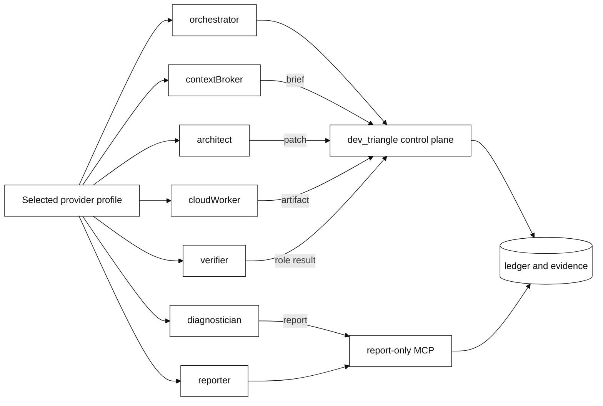

# Provider Profiles

Dev Triangle MCP maps stable role contracts to user-selected API or CLI
bindings. The repository does not ship an implicit provider profile and does
not assign a permanent vendor to a role.

## Profile Selection

The active profile is resolved in this order:

1. `config/active-profile.json`, written by `profile_activate`.
2. `DEV_TRIANGLE_PROFILE`, normally set by installation.
3. No active profile.

There is no fallback to the first file found. A missing profile or role produces
an explicit configuration error.

Committed files:

```text
config/providers.example.json
config/gemini-broker-deny-all.toml
```

Machine-local profiles are ignored because they contain executable paths and
local choices. Secrets are never stored in them; `apiKeyEnv` stores only an
environment-variable name.

## Slot Model


```mermaid
flowchart LR
  P["Selected provider profile"] --> O["orchestrator"]
  P --> B["contextBroker"]
  P --> A["architect"]
  P --> W["cloudWorker"]
  P --> V["verifier"]
  P --> D["diagnostician"]
  P --> R["reporter"]
  O --> M["dev_triangle control plane"]
  B -->|brief| M
  A -->|patch| M
  W -->|artifact| M
  V -->|role result| M
  D -->|report| X["report-only MCP"]
  R --> X
  M --> S[("ledger and evidence")]
  X --> S

  classDef process fill:#ffffff,stroke:#111111,color:#111111,stroke-width:1px;
  classDef store fill:#ffffff,stroke:#111111,color:#111111,stroke-width:1px;
  class P,O,B,A,W,V,D,R,M,X process;
  class S store;
  linkStyle default stroke:#111111,stroke-width:1px;
```

**Figure 1. Fixed provider slots and their bounded return paths.** Empty slots
are allowed. The profile is explicit, and worker roles do not receive the full
control plane.

## Binding Kinds

Each role binding declares its transport:

| `kind` | Required fields | Dispatch behavior |
| --- | --- | --- |
| `api` | `baseUrl`, `model`, optional `apiKeyEnv` | HTTP provider adapter |
| `cli` | `command`, verified `args`, `promptVia`, optional `promptArg` | Local CLI adapter |

`providers/dispatch.py` routes by `kind`, not by display name or vendor. The CLI
command, arguments, prompt transport, and kind are file-only settings because a
natural-language change to an executable is a code-execution boundary.

## Current Validated Local Binding

The accepted `three-account` profile used:

```text
orchestrator   = Codex
contextBroker = Gemini CLI, stdin, deny-all tool policy
architect     = Claude CLI, non-writing mode
verifier      = built-in deterministic suite runner
```

`cloudWorker`, `diagnostician`, and `reporter` are optional for this route. The
Jules and Antigravity compatibility tools remain independently available.

### Acceptance Matrix

| # | Condition | Status | Evidence |
| --- | --- | --- | --- |
| 1 | Profile parsing and fixed slot validation | Pass | `providers/profiles.py`; unit tests |
| 2 | API and CLI dispatch by `kind` | Pass | `providers/dispatch.py`; CLI tests |
| 3 | Broker output contains brief and source references | Pass | Persisted job context brief |
| 4 | Architect output contains a patch path and test plan | Pass | Persisted implementation record |
| 5 | Orchestrator review before patch application | Pass | Accepted disposable-repo run |
| 6 | Machine verification gates `SUCCESS` | Pass | `evidenceLevel=machine`, exit code 0 |
| 7 | Real providers, not only mocks | Pass | Job `dev-triangle-20260820062514-10202cf4` |
| 8 | Rollback restores a clean target tree | Pass | Disposable fixture rollback drill |

The accepted run followed:

```text
Gemini Broker
-> Codex brief review
-> Claude Architect
-> Codex patch review
-> apply_patch
-> target repo deterministic suite
-> persisted SUCCESS
-> rollback-clean fixture
```

Gemini's plan mode alone was not sufficient to prevent writes. The committed
`config/gemini-broker-deny-all.toml` removed every tool; the live write probe
then produced zero tool calls and zero files.

## CLI Binding Rules

1. Verify the CLI's non-interactive syntax before saving it.
2. Prefer stdin for large prompts and Windows command-line limits.
3. Keep safety policy paths absolute when the CLI runs in the target repo.
4. Parse structured JSON; one repair prompt is allowed, not unlimited retries.
5. Treat an exit code 0 with empty output as an explicit provider error unless a
   documented result channel proves completion.
6. Do not report a missing CLI token count as zero. Use
   `tokensAvailable: false`.
7. Re-probe flags, stdin behavior, JSON, timeout, and write policy after a CLI
   upgrade.

## Conversational Changes

Data fields may be changed through `profile_set_role`:

```text
displayName
model
baseUrl
apiKeyEnv
enabled
```

Executable fields remain file-only:

```text
kind
command
args
promptArg
promptVia
```

Every accepted change records the before and after values, scope, verification
status, and the user wording that caused it. `profile_revert_last` records the
undo as another change.

## Whole-Profile Switching

Use `profile_activate` when quota, cost, privacy, or task shape requires a new
set of bindings:

```text
Activate profile claude-heavy.
Undo that.
```

The selected file survives a server restart and takes precedence over the
installer's environment value. There is no automatic failover. A failed role is
reported, and the user chooses the replacement profile.

## Compatibility Providers

The repo retains concrete public tool names:

| Adapter | Purpose | Current status |
| --- | --- | --- |
| `jules_*` | Cloud sessions, patch/PR output, guarded private repo preparation | Implemented compatibility route |
| `antigravity_*` | Local diagnostic handoff and result recovery | Implemented compatibility route |
| `dev_triangle_report_*` | Narrow worker/diagnostician completion channel | Implemented report surface |

These names stay stable for existing clients. They do not define the generic
role architecture.

## Rules That Must Stay Stable

- No implicit provider or model default.
- One explicit orchestrator owns the full control plane.
- Worker and diagnostician roles receive narrow inputs and return paths.
- Outbound repository context is allowlisted and redacted.
- Provider errors do not trigger silent downgrade or failover.
- Patches require orchestrator review and a clean target tree.
- `SUCCESS` requires target-repo machine evidence.
- Mock paths are CI evidence for plumbing, not proof of a real provider route.

See [ARCHITECTURE.md](ARCHITECTURE.md) for the end-to-end figures and
[HANDOFF.md](HANDOFF.md) for the accepted run details.
