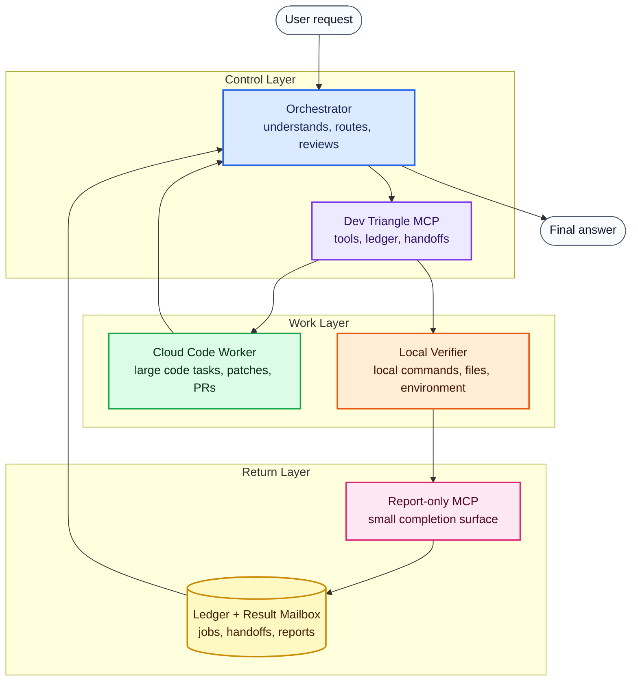
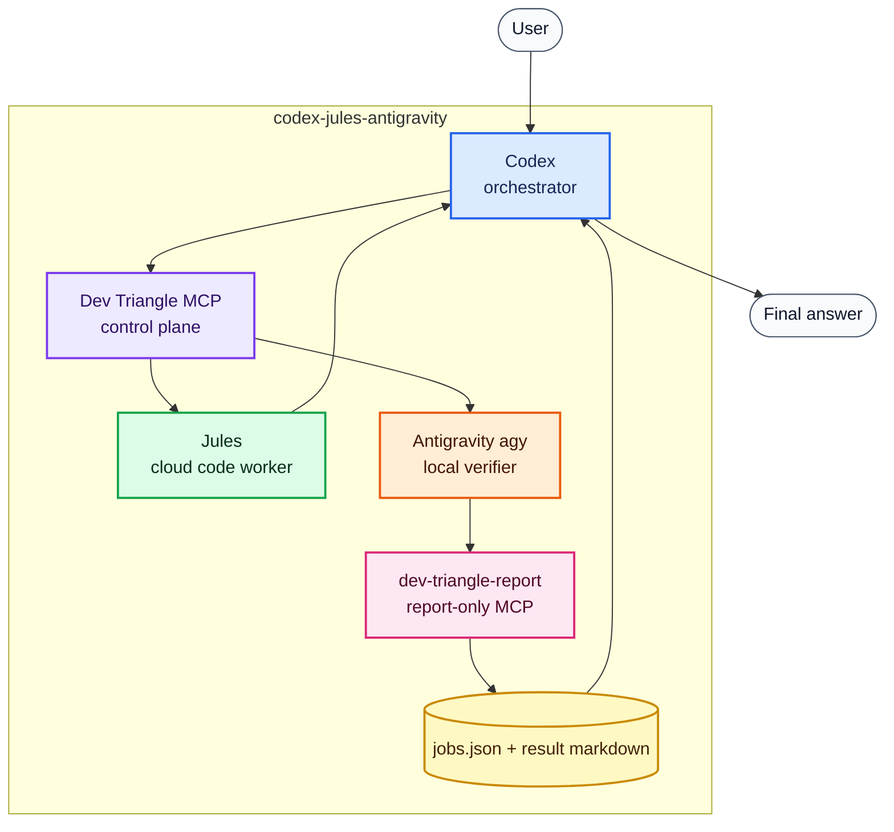

# Role Model

Dev Triangle MCP is easiest to understand as a role-based workflow.

The roles are stable:

```text
User -> Orchestrator -> Dev Triangle MCP -> Workers -> Reporter -> Orchestrator
```

The current default tools are concrete:

```text
Codex -> Dev Triangle MCP -> Jules / Antigravity -> dev-triangle-report -> Codex
```

This means the project is **tool-agnostic in architecture** but **specific in
the current validated implementation**.

## Role Diagram



## Current Default Profile



## Role Contracts

| Role | Contract | Current default | Replaceable later? |
| --- | --- | --- | --- |
| Orchestrator | Talk to the user, choose routes, review results, give final answer | Codex | Yes |
| Cloud Code Worker | Do bounded remote code work and return plan, patch, PR, or artifacts | Jules | Yes |
| Local Verifier | Run local checks and submit a structured verification result | Antigravity `agy` | Yes |
| Reporter | Provide a narrow completion channel for workers | `dev-triangle-report` MCP | Maybe, but should stay narrow |
| Ledger | Track jobs, handoffs, statuses, notes, and result paths | `jobs.json` | Maybe, with migration |

## What Is Implemented Today

Implemented and validated today:

- Codex as the orchestrator.
- Jules tools through the `jules_*` MCP tool group.
- Antigravity handoffs through the `antigravity_*` MCP tool group.
- Report-only completion through `dev-triangle-report`.
- Local job ledger through `jobs.json`.

Documented but not fully implemented yet:

- Claude as the orchestrator.
- Gemini CLI as a code worker.
- Generic provider registry.
- Generic provider tool names.

## Why Tool Names Still Mention Jules And Antigravity

The MCP tool names are intentionally concrete right now:

```text
jules_create_session
run_antigravity_handoff
complete_dev_triangle_handoff
```

That is because these are the compatibility wrappers that exist today. They are
honest about what the runtime can actually do.

A future provider registry may add generic provider tools, but the current
names should remain stable so existing clients do not break.

## Safe Replacement Rule

To replace a role, the replacement should satisfy the same contract.

For example, replacing Jules with another cloud worker requires:

- A way to detect availability.
- A way to create a bounded task.
- A way to get plan/progress/output.
- A way to return patch, PR, artifact, or report.
- A way to avoid exposing unrelated secrets.

Replacing Antigravity with another local verifier requires:

- A way to run or resume a local verification task.
- Access to the local project path.
- A narrow reporting path.
- A result marker or equivalent completion signal.
- Clear timeout and failure behavior.

## Product Wording

Use this wording when explaining the project:

```text
Dev Triangle MCP is a role-based MCP workflow control plane.
The current validated default profile uses Codex, Jules, and Antigravity.
Future provider profiles can map the same roles to other tools.
```

Avoid this wording:

```text
Dev Triangle MCP is only for Codex, Jules, and Antigravity.
Claude/Gemini already work as drop-in replacements.
```

Both statements are misleading in different directions.
