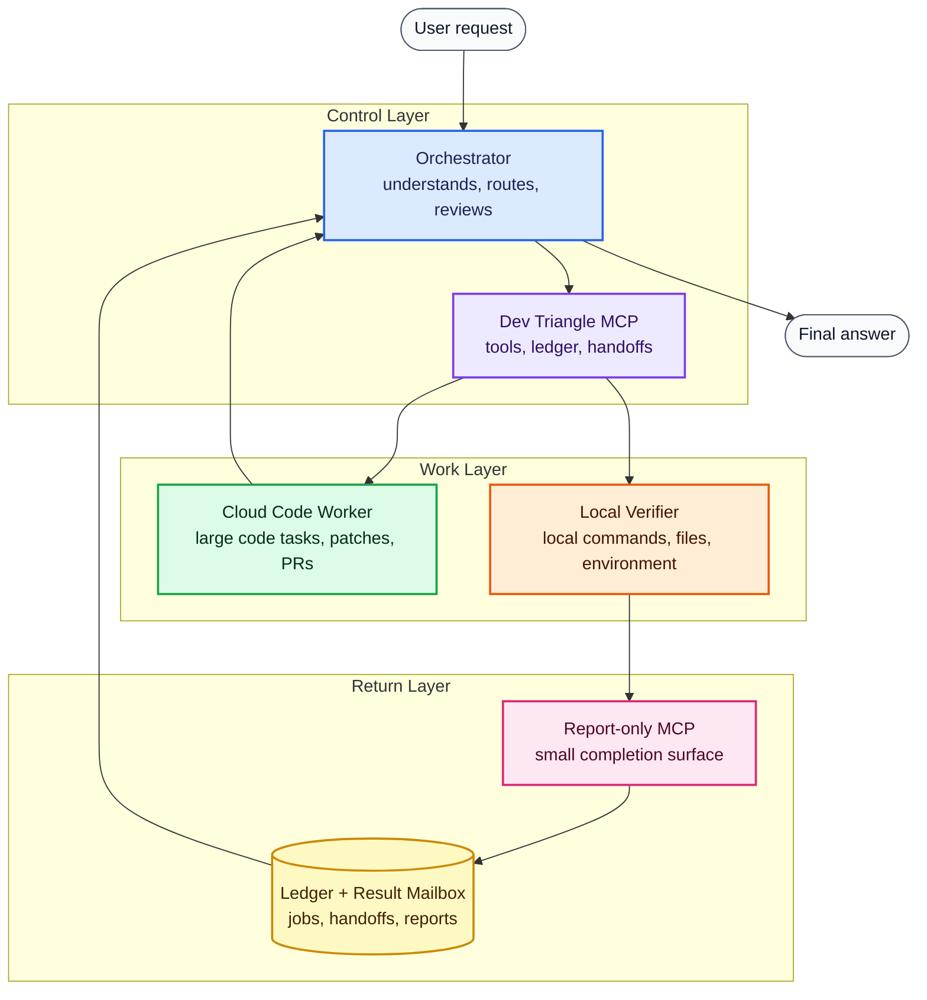
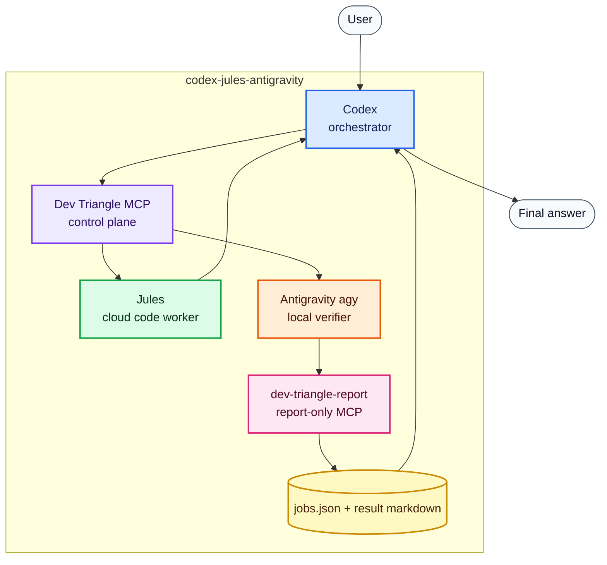

# Role Model

Dev Triangle MCP is easiest to understand as a role-based workflow.

The roles are stable:

```text
User -> Orchestrator -> Dev Triangle MCP -> Workers -> Reporter -> Orchestrator
```

The current default tools are concrete:

```text
Codex -> Dev Triangle MCP -> Jules / Antigravity -> dev-triangle-report -> Codex
```

This means the project is **tool-agnostic in architecture** but **specific in
the current validated implementation**.

## Role Diagram


```mermaid
flowchart TB
  U(["User request"]):::human

  subgraph Control["Control Layer"]
    O["Orchestrator<br/>understands, routes, reviews"]:::orchestrator
    M["Dev Triangle MCP<br/>tools, ledger, handoffs"]:::mcp
  end

  subgraph Work["Work Layer"]
    W["Cloud Code Worker<br/>large code tasks, patches, PRs"]:::worker
    V["Local Verifier<br/>local commands, files, environment"]:::verifier
  end

  subgraph Return["Return Layer"]
    R["Report-only MCP<br/>small completion surface"]:::report
    S[("Ledger + Result Mailbox<br/>jobs, handoffs, reports")]:::state
  end

  U --> O
  O --> M
  M --> W
  M --> V
  W --> O
  V --> R
  R --> S
  S --> O
  O --> A(["Final answer"]):::human

  classDef human fill:#f8fafc,stroke:#475569,color:#0f172a,stroke-width:1px;
  classDef orchestrator fill:#dbeafe,stroke:#2563eb,color:#172554,stroke-width:2px;
  classDef mcp fill:#ede9fe,stroke:#7c3aed,color:#2e1065,stroke-width:2px;
  classDef worker fill:#dcfce7,stroke:#16a34a,color:#052e16,stroke-width:2px;
  classDef verifier fill:#ffedd5,stroke:#ea580c,color:#431407,stroke-width:2px;
  classDef report fill:#fce7f3,stroke:#db2777,color:#500724,stroke-width:2px;
  classDef state fill:#fef9c3,stroke:#ca8a04,color:#422006,stroke-width:2px;
```

## Current Default Profile


```mermaid
flowchart TB
  U(["User"]):::human

  subgraph Default["codex-jules-antigravity"]
    C["Codex<br/>orchestrator"]:::orchestrator
    M["Dev Triangle MCP<br/>control plane"]:::mcp
    J["Jules<br/>cloud code worker"]:::worker
    A["Antigravity agy<br/>local verifier"]:::verifier
    R["dev-triangle-report<br/>report-only MCP"]:::report
    S[("jobs.json + result markdown")]:::state
  end

  U --> C
  C --> M
  M --> J
  M --> A
  J --> C
  A --> R
  R --> S
  S --> C
  C --> F(["Final answer"]):::human

  classDef human fill:#f8fafc,stroke:#475569,color:#0f172a,stroke-width:1px;
  classDef orchestrator fill:#dbeafe,stroke:#2563eb,color:#172554,stroke-width:2px;
  classDef mcp fill:#ede9fe,stroke:#7c3aed,color:#2e1065,stroke-width:2px;
  classDef worker fill:#dcfce7,stroke:#16a34a,color:#052e16,stroke-width:2px;
  classDef verifier fill:#ffedd5,stroke:#ea580c,color:#431407,stroke-width:2px;
  classDef report fill:#fce7f3,stroke:#db2777,color:#500724,stroke-width:2px;
  classDef state fill:#fef9c3,stroke:#ca8a04,color:#422006,stroke-width:2px;
```

## Role Contracts

| Role | Contract | Current default | Replaceable later? |
| --- | --- | --- | --- |
| Orchestrator | Talk to the user, choose routes, review results, give final answer | Codex | Yes |
| Context Broker | Read a whole repo and return a structured brief naming the files the work will touch | Unset by default | Yes, you choose it |
| Architect | Turn a brief into a patch and a test plan. Produces a patch; never edits files | Unset by default | Yes, you choose it |
| Cloud Code Worker | Do bounded remote code work and return plan, patch, PR, or artifacts | Jules | Yes |
| Local Verifier | Run the target repo's own declared commands and capture exit codes as machine evidence | Built-in suite runner | No, this is the evidence source |
| Diagnostician | Investigate and advise. Its output is agent-asserted, not evidence | Antigravity `agy` | Yes |
| Reporter | Provide a narrow completion channel for workers | `dev-triangle-report` MCP | Maybe, but should stay narrow |
| Ledger | Track jobs, handoffs, statuses, notes, and result paths | `jobs.json` | Maybe, with migration |

Two rows changed meaning and are worth reading twice.

**Local Verifier is no longer Antigravity.** Antigravity moved to Diagnostician.
An agent that runs the tests and also writes down whether they passed is the
exact failure this upgrade exists to remove — not because any particular agent
lies, but because there is then nothing to check the report against. Antigravity
is still valuable for investigating *why* something failed; it no longer decides
*whether* it passed.

**Context Broker and Architect have no default.** Not "a default nobody has
picked yet" — no default, ever. An unconfigured role refuses to run and names the
line you need to fill in. See `docs/SAI.md` C10 and `INV-12`.

## What The Jules Route Still Carries

The Broker → Architect route does not replace Jules, and the reason is easy to
miss: `prepare_jules_repo` is the only place in this project that knows how to
put a local project onto GitHub safely. Four protections live there.

| Protection | Where | Does the Broker → Architect route need it? |
| --- | --- | --- |
| Publish safety scan, up to 3,000 files | `scan_repo_for_publish_safety()` | **Rules yes, scan no.** The new route never publishes a repo, so a file-level scan has nothing to guard. What it does need is payload-level scanning, which is why the secret rules were extracted into `providers/redaction.py` — both callers now import one rule set instead of drifting apart |
| Default `.gitignore` | `ensure_default_gitignore()` | **No.** Nothing is pushed, so there is no ignore list to get wrong |
| Repos created private by default | `tool_prepare_jules_repo` | **No.** No repo is created |
| Dry-run by default | `tool_prepare_jules_repo` | **Replaced, not dropped.** The equivalent is `apply_patch` refusing a dirty working tree and recording `appliedAtRef`: this route's undo is a git ref rather than a rehearsal |

**Conclusion: no follow-up work package needed.** The new route bypasses these
protections because it never enters the situations they guard, and the one
genuinely transferable piece — the secret rules — was extracted rather than
copied.

**Jules stays.** It remains the right route when the work is repetitive across
many files and you want a pull request at the end. If that route is ever removed,
the publish scan has to be relocated first, not deleted along with it.

## What Is Implemented Today

Implemented and validated today:

- Codex as the orchestrator.
- Jules tools through the `jules_*` MCP tool group.
- Antigravity handoffs through the `antigravity_*` MCP tool group.
- Report-only completion through `dev-triangle-report`.
- Local job ledger through `jobs.json`.

Added and validated on 2026-08-19:

- Restricted verification suite runner producing real exit codes.
- Quality gate refusing `SUCCESS` without machine evidence.
- Provider profile loader with no default models.
- Natural-language configuration bridge.
- Outbound payload masking with a fail-closed repo allowlist.

Documented but not fully implemented yet:

- Claude as the orchestrator.
- Gemini CLI as a code worker.
- Generic provider registry.
- Generic provider tool names.
- **The Broker → Architect route against a real endpoint.** The adapters, the
  guardrails and the ledger fields are all in place and tested, but every test
  substitutes the transport. Nothing has been sent to a real model yet, so this
  belongs in this list rather than the one above.

## Why Tool Names Still Mention Jules And Antigravity

The MCP tool names are intentionally concrete right now:

```text
jules_create_session
run_antigravity_handoff
complete_dev_triangle_handoff
```

That is because these are the compatibility wrappers that exist today. They are
honest about what the runtime can actually do.

A future provider registry may add generic provider tools, but the current
names should remain stable so existing clients do not break.

## Safe Replacement Rule

To replace a role, the replacement should satisfy the same contract.

For example, replacing Jules with another cloud worker requires:

- A way to detect availability.
- A way to create a bounded task.
- A way to get plan/progress/output.
- A way to return patch, PR, artifact, or report.
- A way to avoid exposing unrelated secrets.

Replacing Antigravity with another local verifier requires:

- A way to run or resume a local verification task.
- Access to the local project path.
- A narrow reporting path.
- A result marker or equivalent completion signal.
- Clear timeout and failure behavior.

## Product Wording

Use this wording when explaining the project:

```text
Dev Triangle MCP is a role-based MCP workflow control plane.
The current validated default profile uses Codex, Jules, and Antigravity.
Future provider profiles can map the same roles to other tools.
```

Avoid this wording:

```text
Dev Triangle MCP is only for Codex, Jules, and Antigravity.
Claude/Gemini already work as drop-in replacements.
```

Both statements are misleading in different directions.
