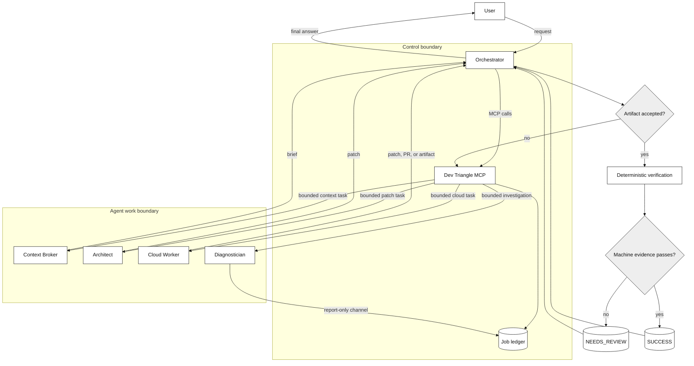

# Role Model

Dev Triangle MCP assigns contracts to role slots and providers to profiles. A
role says what work is allowed. A binding says which API or CLI currently does
that work.

## Fixed Contracts, Flexible Bindings

The seven slot keys are fixed because runtime dispatch depends on them:

| Slot | Contract | May be unconfigured? | Final authority? |
| --- | --- | --- | --- |
| `orchestrator` | Understand the user, select routes, review artifacts, answer | Installation must provide at least one client-side orchestrator | Owns decisions, not test evidence |
| `contextBroker` | Return a grounded brief and source references | Yes | No |
| `architect` | Return a patch and test plan without target writes | Yes | No |
| `cloudWorker` | Return bounded cloud code work, patch, PR, or artifact | Yes | No |
| `verifier` | Identify the verification role; machine evidence still comes from the built-in suite runner | Yes | No agent may declare success alone |
| `diagnostician` | Investigate local failures and return advice | Yes | No; output is `agent_asserted` |
| `reporter` | Provide a narrow completion channel | Yes when no external report channel is needed | No |

The slot key cannot be renamed. `displayName`, model, endpoint, credential
variable name, CLI command, and arguments belong to the user's profile.

## Role Boundary Diagram


```mermaid
flowchart TB
  U["User"] -->|request| O["Orchestrator"]

  subgraph C["Control boundary"]
    O -->|MCP calls| M["Dev Triangle MCP"]
    M --> L[("Job ledger")]
  end

  subgraph A["Agent work boundary"]
    B["Context Broker"]
    P["Architect"]
    W["Cloud Worker"]
    D["Diagnostician"]
  end

  M -->|bounded context task| B
  B -->|brief| O
  M -->|bounded patch task| P
  P -->|patch| O
  M -->|bounded cloud task| W
  W -->|patch, PR, or artifact| O
  M -->|bounded investigation| D
  D -->|report-only channel| L
  O --> G{"Artifact accepted?"}
  G -->|no| M
  G -->|yes| V["Deterministic verification"]
  V --> Q{"Machine evidence passes?"}
  Q -->|no| N[("NEEDS_REVIEW")]
  Q -->|yes| S[("SUCCESS")]
  N --> O
  S --> O
  O -->|final answer| U

  classDef process fill:#ffffff,stroke:#111111,color:#111111,stroke-width:1px;
  classDef decision fill:#eeeeee,stroke:#111111,color:#111111,stroke-width:1px;
  classDef store fill:#ffffff,stroke:#111111,color:#111111,stroke-width:1px;
  class U,O,M,B,P,W,D,V process;
  class G,Q decision;
  class L,N,S store;
  linkStyle default stroke:#111111,stroke-width:1px;
```

**Figure 1. Separation of control authority, agent work, and machine
evidence.** Agent output returns to review; it does not bypass the acceptance
gate.

## Current Validated Binding

The real local acceptance run used:

| Role | Binding | Enforced boundary |
| --- | --- | --- |
| Orchestrator | Codex | Full MCP; reviews the brief and patch |
| Context Broker | Gemini CLI | Stdin prompt plus committed deny-all tool policy |
| Architect | Claude CLI | Non-writing mode; returns unified diff |
| Verifier | Built-in deterministic suite runner | Target repo allowlist; records exit code and logs |
| Ledger | `jobs.json` | Persists route, destinations, artifacts, and evidence |

This table describes one accepted deployment. It does not make those vendors
permanent. A different binding is valid after it satisfies the same contract and
real-path acceptance gates.

## Why Context Broker and Architect Are Separate

The Context Broker reduces and grounds the source context. The Architect works
from that reviewed brief and the identified source files. The separation:

- reduces the amount of context sent to the patch-producing model;
- gives the orchestrator a review point before code generation;
- records which source references supported the implementation request; and
- allows either role to be rebound without changing the workflow contract.

An `architect-only` route is also valid when the source set is already small and
explicit. The job records that route so later analysis can distinguish it from
Broker-Architect work.

## Evidence Is Not A Role Claim

An agent may recommend that a change is correct. That result is
`agent_asserted`. `SUCCESS` requires `run_verification_suite` to execute the
target repository's declared commands and record `evidenceLevel: machine` with
exit code 0.

Antigravity therefore remains useful as a diagnostician. It is not the final
verifier, even if it ran commands during its investigation.

## Compatibility Routes

The public names below remain supported:

```text
jules_*        cloud-worker compatibility adapter
antigravity_*  diagnostician and report-channel compatibility adapter
```

Jules remains useful for repetitive, PR-shaped cloud work and guarded private
repository preparation. Antigravity remains useful for local diagnosis and
environment-specific inspection. Neither compatibility route defines the
provider-independent architecture.

## Safe Replacement Rule

A replacement binding must prove:

1. Availability detection and explicit failure.
2. Bounded input and structured output.
3. Secret redaction and repository allowlisting for outbound context.
4. No access to the full control plane from worker roles.
5. Review before target mutation.
6. Machine verification before `SUCCESS`.
7. A real path, not only mocks.

There is no silent failover. If a provider is unavailable or out of quota, the
job reports the failed role and destination. The user selects another profile.

## Product Wording

Use:

```text
Dev Triangle MCP is a role-based MCP control plane with user-selected API and
CLI bindings. The accepted three-account deployment uses Codex orchestration,
Gemini context brokering, Claude patch generation, and deterministic local
verification. The providers are replaceable; the review and evidence gates are
not.
```

Avoid:

```text
Every agent can be the brain automatically.
The system silently changes models when quota is exhausted.
An agent report is enough to mark the job successful.
```
