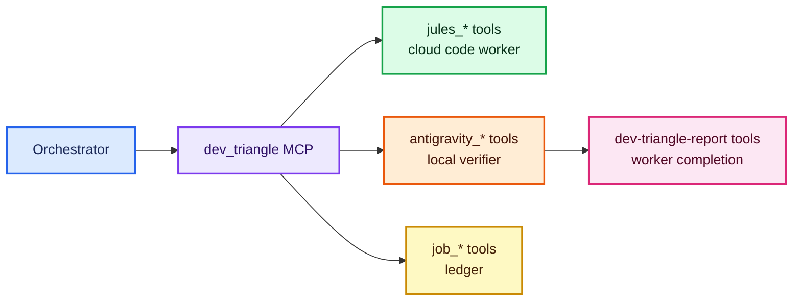

# Tool Reference

This document explains the MCP tools in human language. It is not a replacement
for the JSON schemas in the source code, but it should help users understand
which tool exists for which job.

## Role-Based View

The architecture is role-based:

```text
Orchestrator -> Dev Triangle MCP -> Worker / Verifier -> Reporter
```

The current tool names are concrete because the current implemented providers
are concrete:

```text
jules_*        -> current cloud code worker tools
prepare_jules_repo -> local project publishing guard for Jules
antigravity_*  -> current local verifier tools
job_*          -> shared ledger tools
```

Future provider work may add generic provider internals, but these public names
should remain stable compatibility wrappers for the current default profile.



## Main Server: `dev_triangle`

File:

```text
server.py
```

Audience:

```text
Orchestrator agents, currently Codex by default.
```

Do not expose this full server to normal worker agents unless you intentionally
want them to control the whole workflow.

## Jules Tools

### `prepare_jules_repo`

Inspects or publishes a local project as a GitHub repository that Jules can use.

Default behavior:

```text
publish = false
```

That means the tool performs a dry-run only. It reports:

- Whether the folder is already a git repo.
- Whether a GitHub remote already exists.
- Which Jules source string would be used.
- Which `.gitignore` safety entries would be added.
- Whether likely secrets or risky files were found.

Publishing behavior:

```text
publish = true
confirmPublish = true
visibility = private
```

When publishing, the tool can:

- Add Dev Triangle `.gitignore` safety defaults.
- Run `git init` if needed.
- Create an initial commit if needed.
- Create a private GitHub repo through `gh`.
- Add the GitHub remote.
- Push the selected branch.
- Return `sources/github/owner/repo` for `jules_create_session`.

Safety rules:

- Publishing requires `confirmPublish=true`.
- Public repos require `confirmPublic=true`.
- Existing dirty repos are blocked unless `commitChanges=true`.
- Potential secrets block publishing unless they are ignored and untracked.
- The tool does not store `JULES_API_KEY`.

### `jules_list_sources`

Lists repositories already connected to Jules.

Use this before creating a repository-backed Jules session. It helps the
orchestrator find the correct source name instead of guessing.

Common use:

```text
Find whether owner/repo is connected to Jules.
```

### `jules_list_sessions`

Lists recent Jules sessions for the authenticated user.

Common use:

```text
Find recent cloud coding work and reconnect it to the local ledger.
```

### `jules_create_session`

Creates a Jules coding session.

Important default:

```text
requirePlanApproval = true
```

That default is intentional. It gives the orchestrator or user a chance to
review the plan before Jules starts changing code.

Good tasks:

- Large test additions.
- Repetitive migrations.
- Dependency upgrades.
- PR-shaped work.

### `jules_get_session`

Reads one Jules session and updates the local job ledger.

Use this after creating a session or when checking progress.

### `jules_list_activities`

Lists activity from a Jules session.

Activities can include:

- Plans.
- Progress updates.
- Messages.
- Artifacts.
- Patch references.

Use this when deciding whether Jules needs feedback, approval, or final review.

### `jules_send_message`

Sends feedback or additional instructions to Jules.

Use this when:

- A plan needs correction.
- The task scope changed.
- The output missed an acceptance criterion.

### `jules_approve_plan`

Approves a pending Jules plan.

Use this only after reviewing the plan. The default product behavior is to avoid
unreviewed cloud code changes.

### `jules_get_outputs`

Gets completed Jules outputs.

Use `includePatches=true` when you want patch artifacts included in the result.

### `jules_save_latest_patch`

Finds the latest git patch artifact in a Jules session and saves it under the
local patch directory.

Common use:

```text
Get the cloud worker patch into local state so Codex can inspect or apply it.
```

## Antigravity Tools

### `create_antigravity_handoff`

Creates a local handoff markdown file for Antigravity.

A good handoff includes:

- Title.
- Objective.
- Repo path.
- Context.
- Relevant files.
- Suggested commands.
- Acceptance criteria.

The handoff is a contract. It tells the local verifier what to do and what
counts as done.

### `antigravity_detect_cli`

Checks whether an Antigravity CLI command is available.

Default expected command:

```text
agy
```

On many Windows installs, the resolved path is:

```text
%LOCALAPPDATA%\agy\bin\agy.exe
```

Use this before trying to run a real handoff.

Optional diagnostics:

- `smokePrint`: runs a short `agy --print` smoke.
- `smokeTimeoutSec`: timeout for that smoke.

The smoke is diagnostic. Some Antigravity planner/tool-call streams can exit
with empty stdout, so a failed print smoke does not mean `agy` is missing; it
means headless completion capture needs the result mailbox/report MCP path.

### `run_antigravity_handoff`

Runs a prepared handoff through Antigravity CLI.

Stable unattended execution style:

```text
agy_print
```

Useful options:

- `dryRun`: builds the command without launching Antigravity.
- `waitForResult`: waits for the closed-loop result.
- `resultTimeoutSec`: how long to wait for the result marker.
- `emptyStdoutResultGraceSec`: short grace wait when `agy --print` exits 0 with
  empty stdout and no result file.
- `pollIntervalSec`: how often to check for the result.

The command is considered fully complete when the result path is ready and the
marker is present.

If `agy --print` exits 0 but stdout is empty and no result appears, the handoff
is marked `DEGRADED_NO_RESULT`. Treat stdout as diagnostic only; use
`complete_dev_triangle_handoff` or the result marker as the completion signal.

### `antigravity_get_result`

Reads or waits for an Antigravity result file.

Use this after launching a handoff, especially when the handoff status is
`AWAITING_RESULT`.

### `submit_antigravity_result`

Submits a completed Antigravity result through the main server.

This exists for agents that can call the main server directly. In the preferred
worker setup, Antigravity normally calls the report-only server's
`complete_dev_triangle_handoff` instead.

## Ledger And Diagnostics Tools

### `mcp_health_check`

Checks server paths, ledger counts, Jules key presence, optional Jules
reachability, and Antigravity CLI detection.

Use this as the first diagnostic tool.

Optional diagnostics:

- `includeAntigravityPrintSmoke`: run the `agy --print` smoke.
- `antigravitySmokeTimeoutSec`: timeout for that smoke.

### `job_list`

Lists local jobs and handoffs from the ledger.

Filters:

- Provider.
- Status.
- Limit.

### `job_get`

Gets one job or handoff by id.

Use this when you need exact paths, status, notes, or result data.

### `job_update`

Updates one local job or handoff status and appends notes.

Use this for manual bookkeeping when a human decision changes the status.

## Report Server: `dev-triangle-report`

File:

```text
antigravity_report_server.py
```

Audience:

```text
Worker/verifier agents, especially Antigravity.
```

This server intentionally has only two tools.

### `dev_triangle_report_health`

Checks whether the report-only server is reachable and points at the expected
state directory.

### `complete_dev_triangle_handoff`

Submits the final worker report.

Required fields:

- `handoff`
- `summary`

Useful fields:

- `status`
- `recommendation`
- `commandsRun`
- `findings`
- `followUps`
- `resultPath`

The report server writes a markdown result and includes:

```text
DEV_TRIANGLE_RESULT_READY
```

Codex uses that marker to know the result is ready.

## Tool Safety Summary

| Tool group | Who should use it | Why |
| --- | --- | --- |
| Jules tools | Orchestrator | Cloud coding control |
| Antigravity handoff tools | Orchestrator | Local validation routing |
| Ledger tools | Orchestrator | Tracking and audit |
| Report tools | Workers | Narrow result submission |

The design avoids giving worker agents broad orchestration powers.
