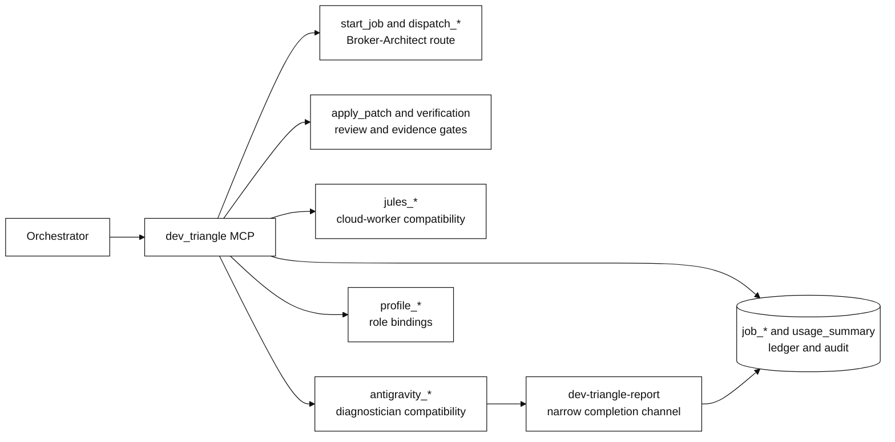

# Tool Reference

This document explains the MCP tools in human language. It is not a replacement
for the JSON schemas in the source code, but it should help users understand
which tool exists for which job.

## Role-Based View

The architecture is role-based:

```text
Orchestrator -> Dev Triangle MCP -> role dispatch -> review -> machine evidence
```

Generic closed-loop tools coexist with concrete compatibility adapters:

```text
jules_*        -> current cloud code worker tools
prepare_jules_repo -> local project publishing guard for Jules
antigravity_*  -> current local diagnostician tools
dispatch_*     -> Context Broker and Architect tools
run_verification_suite -> deterministic machine evidence
profile_*      -> role-binding and whole-profile controls
job_*          -> shared ledger tools
```

The concrete public names remain stable compatibility wrappers. They do not
make Jules or Antigravity the architecture's fixed default.


```mermaid
flowchart LR
  O["Orchestrator"] --> M["dev_triangle MCP"]
  M --> BA["start_job and dispatch_*<br/>Broker-Architect route"]
  M --> PV["apply_patch and verification<br/>review and evidence gates"]
  M --> JT["jules_*<br/>cloud-worker compatibility"]
  M --> AT["antigravity_*<br/>diagnostician compatibility"]
  M --> PT["profile_*<br/>role bindings"]
  M --> LT[("job_* and usage_summary<br/>ledger and audit")]
  AT --> RT["dev-triangle-report<br/>narrow completion channel"]
  RT --> LT

  classDef process fill:#ffffff,stroke:#111111,color:#111111,stroke-width:1px;
  classDef store fill:#ffffff,stroke:#111111,color:#111111,stroke-width:1px;
  class O,M,BA,PV,JT,AT,PT,RT process;
  class LT store;
  linkStyle default stroke:#111111,stroke-width:1px;
```

**Figure 1. Main MCP tool groups and the narrow report return path.**

## Main Server: `dev_triangle`

File:

```text
server.py
```

Audience:

```text
The selected orchestrator. The accepted local binding currently uses Codex.
```

Do not expose this full server to normal worker agents unless you intentionally
want them to control the whole workflow.

## Broker-Architect And Verification Tools

### `start_job`

Creates a ledger job for `broker-architect`, `architect-only`, or another
supported route. It records the repository, request, source paths, route, and
profile before dispatch begins.

### `dispatch_context_brief`

Sends allowlisted, redacted repository context to the configured
`contextBroker`. The result must be structured and identify source references.

### `dispatch_architect`

Sends the reviewed brief and selected sources to the configured `architect`.
The expected result is a patch and test plan, not direct target-repo edits.

### `apply_patch`

Applies an orchestrator-reviewed patch. It refuses a dirty target tree and
records the target ref and applied patch path for audit and rollback.

### `run_verification_suite`

Runs only the commands declared in the target repo's
`.dev-triangle/verify.json`. It records real exit codes, outputs, duration, and
`evidenceLevel: machine`. A job cannot reach `SUCCESS` without passing machine
evidence.

### `self_heal`

Allows at most one repair attempt after machine verification fails. It does not
create an unbounded agent loop and it does not bypass patch review.

## Jules Tools

### `prepare_jules_repo`

Inspects or publishes a local project as a GitHub repository that Jules can use.

Default behavior:

```text
publish = false
```

That means the tool performs a dry-run only. It reports:

- Whether the folder is already a git repo.
- Whether a GitHub remote already exists.
- Which Jules source string would be used.
- Which `.gitignore` safety entries would be added.
- Whether likely secrets or risky files were found.

Publishing behavior:

```text
publish = true
confirmPublish = true
visibility = private
```

When publishing, the tool can:

- Add Dev Triangle `.gitignore` safety defaults.
- Run `git init` if needed.
- Create an initial commit if needed.
- Create a private GitHub repo through `gh`.
- Add the GitHub remote.
- Push the selected branch.
- Return `sources/github/owner/repo` for `jules_create_session`.

Safety rules:

- Publishing requires `confirmPublish=true`.
- Public repos require `confirmPublic=true`.
- Existing dirty repos are blocked unless `commitChanges=true`.
- Potential secrets block publishing unless they are ignored and untracked.
- The tool does not store `JULES_API_KEY`.

### `jules_list_sources`

Lists repositories already connected to Jules.

Use this before creating a repository-backed Jules session. It helps the
orchestrator find the correct source name instead of guessing.

Common use:

```text
Find whether owner/repo is connected to Jules.
```

### `jules_list_sessions`

Lists recent Jules sessions for the authenticated user.

Common use:

```text
Find recent cloud coding work and reconnect it to the local ledger.
```

### `jules_create_session`

Creates a Jules coding session.

Important default:

```text
requirePlanApproval = true
```

That default is intentional. It gives the orchestrator or user a chance to
review the plan before Jules starts changing code.

Good tasks:

- Large test additions.
- Repetitive migrations.
- Dependency upgrades.
- PR-shaped work.

### `jules_get_session`

Reads one Jules session and updates the local job ledger.

Use this after creating a session or when checking progress.

### `jules_list_activities`

Lists activity from a Jules session.

Activities can include:

- Plans.
- Progress updates.
- Messages.
- Artifacts.
- Patch references.

Use this when deciding whether Jules needs feedback, approval, or final review.

### `jules_send_message`

Sends feedback or additional instructions to Jules.

Use this when:

- A plan needs correction.
- The task scope changed.
- The output missed an acceptance criterion.

### `jules_approve_plan`

Approves a pending Jules plan.

Use this only after reviewing the plan. The default product behavior is to avoid
unreviewed cloud code changes.

### `jules_get_outputs`

Gets completed Jules outputs.

Use `includePatches=true` when you want patch artifacts included in the result.

### `jules_save_latest_patch`

Finds the latest git patch artifact in a Jules session and saves it under the
local patch directory.

Common use:

```text
Get the cloud worker patch into local state so Codex can inspect or apply it.
```

## Antigravity Tools

### `create_antigravity_handoff`

Creates a local handoff markdown file for Antigravity.

A good handoff includes:

- Title.
- Objective.
- Repo path.
- Context.
- Relevant files.
- Suggested commands.
- Acceptance criteria.

The handoff is a contract. It tells the local verifier what to do and what
counts as done.

### `antigravity_detect_cli`

Checks whether an Antigravity CLI command is available.

Default expected command:

```text
agy
```

On many Windows installs, the resolved path is:

```text
%LOCALAPPDATA%\agy\bin\agy.exe
```

Use this before trying to run a real handoff.

Optional diagnostics:

- `smokePrint`: runs a short `agy --print` smoke.
- `smokeTimeoutSec`: timeout for that smoke.

The smoke is diagnostic. Some Antigravity planner/tool-call streams can exit
with empty stdout, so a failed print smoke does not mean `agy` is missing; it
means headless completion capture needs the result mailbox/report MCP path.
If the environment contains the legacy unsafe `Gemini 3.5 Flash (Medium)`
model value, Dev Triangle ignores it and reports that through `agyModelNote`.
When stdout is empty but the model response is stored in the Antigravity
conversation SQLite database, Dev Triangle checks the recent databases under
`%USERPROFILE%\.gemini\antigravity-cli\conversations` and can mark the smoke
passed from that fallback. Set `ANTIGRAVITY_AGY_CONVERSATION_DIR` only when a
test or custom install stores those databases elsewhere.

### `run_antigravity_handoff`

Runs a prepared handoff through Antigravity CLI.

Stable unattended execution style:

```text
agy_print
```

Useful options:

- `dryRun`: builds the command without launching Antigravity.
- `waitForResult`: waits for the closed-loop result.
- `resultTimeoutSec`: how long to wait for the result marker.
- `emptyStdoutResultGraceSec`: short grace wait when `agy --print` exits 0 with
  empty stdout and no result file.
- `pollIntervalSec`: how often to check for the result.

The command is considered fully complete when the result path is ready and the
marker is present.

If `agy --print` exits 0 but stdout is empty and no result appears, the handoff
is marked `DEGRADED_NO_RESULT`. Treat stdout as diagnostic only; use
`complete_dev_triangle_handoff` or the result marker as the completion signal.
Before returning `DEGRADED_NO_RESULT`, Dev Triangle also checks recent
Antigravity conversation databases for `DEV_TRIANGLE_RESULT_READY`. If the
marker is found in a non-user response step, the server writes the recovered
content to the result path and marks the handoff `COMPLETED`.

### `antigravity_get_result`

Reads or waits for an Antigravity result file.

Use this after launching a handoff, especially when the handoff status is
`AWAITING_RESULT`.

### `submit_antigravity_result`

Submits a completed Antigravity result through the main server.

This exists for agents that can call the main server directly. In the preferred
worker setup, Antigravity normally calls the report-only server's
`complete_dev_triangle_handoff` instead.

## Ledger And Diagnostics Tools

### `mcp_health_check`

Checks server paths, ledger counts, Jules key presence, optional Jules
reachability, and Antigravity CLI detection.

Use this as the first diagnostic tool.

Optional diagnostics:

- `includeAntigravityPrintSmoke`: run the `agy --print` smoke.
- `antigravitySmokeTimeoutSec`: timeout for that smoke.

### `job_list`

Lists local jobs and handoffs from the ledger.

Filters:

- Provider.
- Status.
- Limit.

### `job_get`

Gets one job or handoff by id.

Use this when you need exact paths, status, notes, or result data.

### `job_update`

Updates one local job or handoff status and appends notes.

Use this for manual bookkeeping when a human decision changes the status.

### `usage_summary`

Rolls dispatches up by profile, role, kind, destination, and model. Optional
`profile` and `sinceDays` inputs narrow the report.

Calls and tokens stay separate. CLI-backed rows have
`tokensAvailable: false`, and `unmeasuredRows` identifies the exact profile and
executable whose token count is unavailable; those calls still spend a
subscription.

### `profile_describe`

Shows the active or named profile, every role binding, unconfigured roles,
unverified model ids, shared models, and recent configuration changes. This
tool is read-only.

### `profile_activate`

Switches the whole active profile and persists the selected name in the
generated `config/active-profile.json`. The return reports before and after,
the effective source, each binding, and any unconfigured roles.

Activation never chooses a fallback profile automatically. The user selects
the replacement and can say "undo that" to return to the previous profile.

### `profile_set_role`

Changes one existing role binding, permanently by default or for one job when
`scope: thisJob` is used. Every change reports before and after and is appended
to `configChanges` with the relayed user utterance.

Only data fields are conversationally writable. Executable `command`, `args`,
`promptArg`, and `kind` remain file-only. `apiKeyEnv` accepts an environment
variable name, never a credential value.

### `profile_revert_last`

Reverses one or more recent profile or active-profile changes and records the
revert as another ledger entry. It refuses to undo an activation to "no
profile", because that would leave every role unreachable.

## Report Server: `dev-triangle-report`

File:

```text
antigravity_report_server.py
```

Audience:

```text
Worker or diagnostician agents, especially the Antigravity compatibility route.
```

This server intentionally has only two tools.

### `dev_triangle_report_health`

Checks whether the report-only server is reachable and points at the expected
state directory.

### `complete_dev_triangle_handoff`

Submits the final worker report.

Required fields:

- `handoff`
- `summary`

Useful fields:

- `status`
- `recommendation`
- `commandsRun`
- `findings`
- `followUps`
- `resultPath`

The report server writes a markdown result and includes:

```text
DEV_TRIANGLE_RESULT_READY
```

Codex uses that marker to know the result is ready.

## Tool Safety Summary

| Tool group | Who should use it | Why |
| --- | --- | --- |
| Broker-Architect dispatch | Orchestrator | Bounded context and patch production |
| Patch and verification tools | Orchestrator | Review, local mutation, and machine evidence |
| Profile tools | Orchestrator | Explicit provider selection and audit |
| Jules tools | Orchestrator | Cloud coding control |
| Antigravity handoff tools | Orchestrator | Local diagnostic routing |
| Ledger tools | Orchestrator | Tracking and audit |
| Report tools | Workers or diagnosticians | Narrow result submission |

The design avoids giving worker agents broad orchestration powers.
