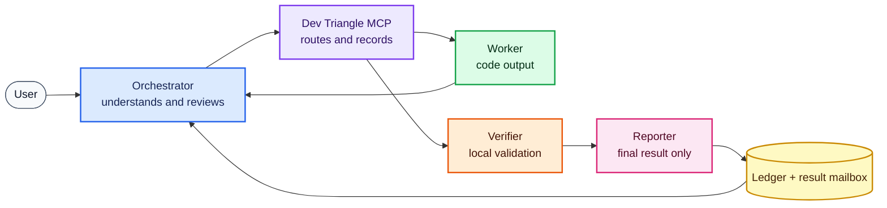
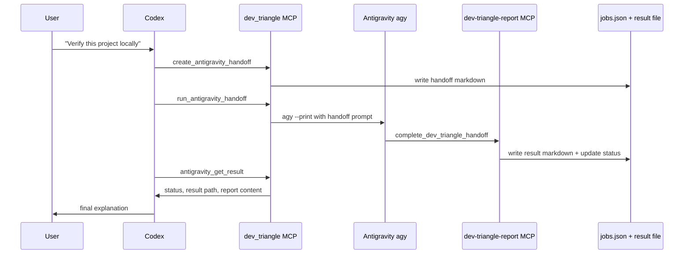

# User Guide

This guide explains Dev Triangle MCP for a human who wants to use it, not just
read the source code.

## The Short Version

Dev Triangle MCP lets one main AI agent coordinate other AI coding agents
through stable roles.

The default setup is:

```text
You talk to Codex.
Codex talks to Dev Triangle MCP.
Dev Triangle MCP can send work to Jules.
Dev Triangle MCP can send local validation to Antigravity.
Workers report back through a controlled result channel.
Codex gives you the final answer.
```

The role-based setup is:

```text
You talk to the orchestrator.
The orchestrator talks to Dev Triangle MCP.
Dev Triangle MCP routes work to a worker or verifier.
The worker reports back through a narrow return channel.
The orchestrator reviews the result and answers you.
```

The useful part is not merely launching tools. The useful part is that every
task has a record, every handoff has a result path, and Codex can wait for the
worker to finish instead of relying on manual copy and paste.

## What Problem It Solves

Without a control plane, a multi-agent workflow often looks like this:

1. You ask one AI to make a plan.
2. You copy the plan into another AI.
3. You wait.
4. You copy the result back.
5. You ask another AI to verify it.
6. You forget which output belongs to which task.
7. You manually decide whether the result is done.

Dev Triangle MCP turns that into a trackable loop:

1. Codex creates a job or handoff.
2. The worker receives a narrow task.
3. The worker writes a structured result.
4. Codex reads the result from the ledger.
5. Codex decides the next step.

## The Role Model



See [Role Model](ROLE_MODEL.md) for the tool-agnostic contract.

## The Default Jobs

### Codex: Orchestrator

Codex is the agent you talk to. It should own:

- Understanding your request.
- Inspecting the repository.
- Deciding whether work should stay local or be delegated.
- Creating Jules sessions when useful.
- Creating Antigravity handoffs when local validation is useful.
- Reviewing results from workers.
- Giving you the final answer.

Codex gets the full MCP server because it is the only role that should control
the whole workflow.

### Jules: Cloud Coding Worker

Jules is useful when work is large, repetitive, or PR-shaped.

Good Jules tasks:

- Add tests across many files.
- Migrate an old API.
- Refactor repeated code.
- Upgrade dependency usage.
- Generate a patch or PR for Codex to review.

Jules needs `JULES_API_KEY` in the environment. Dev Triangle MCP does not store
that key.

### Antigravity: Local Verifier

Antigravity is useful when work depends on your local machine.

Good Antigravity tasks:

- Run local smoke tests.
- Inspect local project files.
- Verify Docker or local services.
- Confirm a UI or CLI works on the actual machine.
- Write a structured report back to Codex.

The stable unattended route is:

```text
agy --print
```

The older IDE chat launch route can open a UI, but it is not the preferred
closed-loop path for unattended runs.

## Why There Are Two MCP Servers

There are two servers because different agents need different permissions.

### `dev_triangle`

This is the main control-plane server.

It can:

- Call Jules.
- Create Antigravity handoffs.
- Launch Antigravity.
- Read and write the local ledger.
- Check health.

Only the orchestrator should see this server.

### `dev-triangle-report`

This is the report-only server.

It can:

- Say whether the report server is healthy.
- Accept a final handoff report.

Worker agents can see this server because it is intentionally tiny. It does not
let them create more cloud sessions, modify unrelated jobs, or run arbitrary
commands.

## What A Closed Loop Means

A closed loop means Codex can create a task, wait for the worker, and read the
final result without the user manually carrying messages between tools.

For Antigravity, the loop is:



The result is considered ready when:

- The handoff status is `COMPLETED`.
- The result file exists.
- The result contains `DEV_TRIANGLE_RESULT_READY`.

## What The Ledger Does

The ledger is a local JSON file:

```text
%USERPROFILE%\.dev-triangle\jobs.json
```

It stores:

- Jules jobs.
- Antigravity handoffs.
- Statuses.
- Timestamps.
- Result paths.
- Notes.

This gives the workflow memory without committing runtime data to Git.

## How To Decide The Route

Use this practical rule:

| Situation | Best route |
| --- | --- |
| Tiny fix, clear local file | Codex directly |
| Many repeated edits | Jules |
| Needs a PR or cloud patch | Jules |
| Needs local commands or local services | Antigravity |
| Needs both broad code work and local verification | Jules first, Antigravity second |
| Needs sensitive local secrets | Usually keep it local; do not send secrets to workers |

## Example Prompts

Small local task:

```text
Use Dev Triangle MCP only if needed. Inspect this repo and add a smoke test for
the command parser. If the change is small, keep it local and verify it here.
```

Jules-shaped task:

```text
Use Dev Triangle MCP and create a Jules task if appropriate.

Goal:
Migrate all legacy config readers to the new settings loader and open a PR or
return a patch. Require plan approval before code changes.
```

Antigravity-shaped task:

```text
Use Dev Triangle MCP to create an Antigravity handoff.

Goal:
Run the local Docker smoke test, inspect the generated logs, and submit a final
report through dev-triangle-report.
```

Full triangle task:

```text
Use Dev Triangle MCP for this project.

Goal:
Have Jules add the missing tests, then have Antigravity run local verification,
then give me a final merge/no-merge recommendation.
```

## What To Check When It Feels Stuck

First run:

```powershell
.\scripts\doctor.ps1
```

Then check the ledger:

```text
%USERPROFILE%\.dev-triangle\jobs.json
```

Then check the result directory:

```text
%USERPROFILE%\.dev-triangle\antigravity-results
```

If a handoff is stuck at `AWAITING_RESULT`, the worker launched but did not
write the result marker. See [Troubleshooting](TROUBLESHOOTING.md).

## Human Expectations

Dev Triangle MCP is a coordination layer. It should make the workflow easier to
run and easier to audit. It does not remove the need for code review, tests, or
human judgment when the change matters.

The safest default is:

- Codex decides.
- Workers do narrow jobs.
- Results return through MCP.
- Codex verifies.
- The user sees a clear final report.
